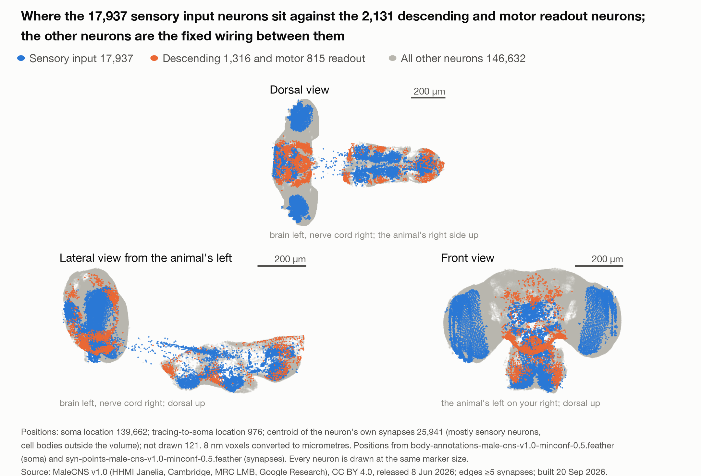
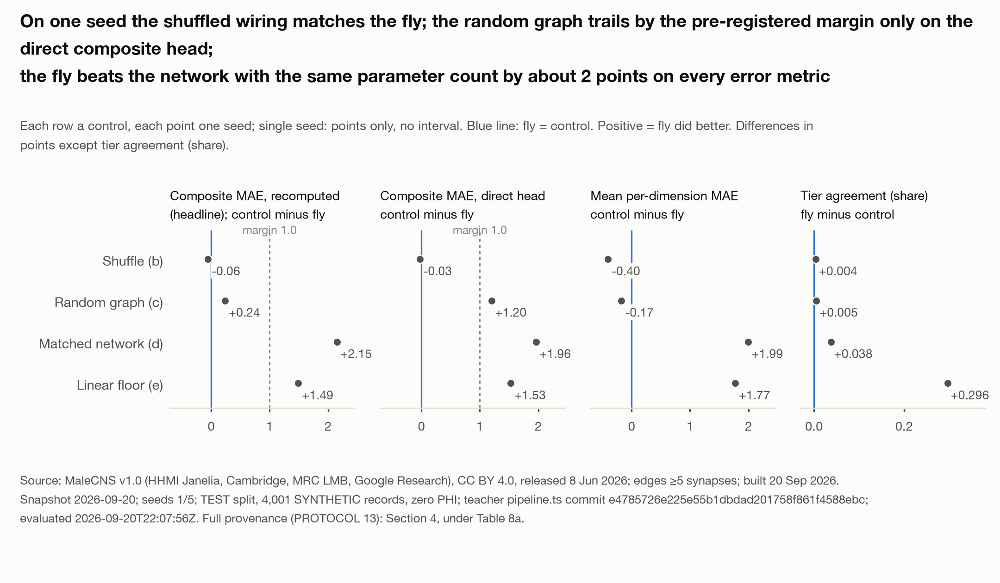
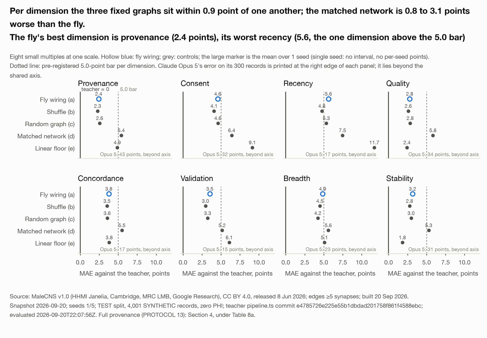

# Intelligence Is Structure, Not Scale

**A fruit fly's brain beat Claude, GPT-5, Grok and Gemini at judging health records.**

Code, derived data and the paper for *Intelligence Is Structure, Not Scale: A Whole Central Nervous System Connectome
as a Fixed Substrate for Scoring Health Data Trust* (Jason Alan Snyder, SuperTruth Inc., September 2026).

| | |
|---|---|
| Paper (Zenodo, CC BY 4.0) | https://doi.org/10.5281/zenodo.22865214 |
| Dataset: 20,000 synthetic records, every engine score, the trained fly model | https://doi.org/10.5281/zenodo.22865020 |
| Plain summary and 3D viewer of the wiring | https://supertruth.ai/research/connectome |
| The story, by the author | https://supertruth.ai/blog/fruit-fly-brain-beat-four-ai-models-at-judging-health-records |
| The DTI paper this builds on | https://doi.org/10.5281/zenodo.19601616 |

*Figure 1. The fruit fly wiring SuperTruth used, and did not change: 166,700 nerve cells and 6,242,118 connections of five or
more synapses. Blue marks the cells where a record goes in; orange the cells where the score comes out; grey the fixed wiring
between them. Every connection shown was mapped by scientists under an electron microscope. Source: MaleCNS v1.0, HHMI Janelia
Research Campus with the University of Cambridge, the MRC Laboratory of Molecular Biology and Google Research, released 8 June
2026, CC BY 4.0, https://male-cns.janelia.org/; SuperTruth derived graph, 20 September 2026.*

## What we did

In June 2026, scientists at HHMI Janelia Research Campus, the University of Cambridge, the MRC Laboratory of Molecular Biology
and Google Research finished mapping a fruit fly's entire central nervous system: every nerve cell and every connection between
them, photographed slice by slice under an electron microscope, and released for anyone to use.

We took that map as it was. We did not add a connection or move one. We only adjusted how strongly each connection spoke, the
way you turn a volume knob up or down, plus a way in (a record's fields written into the fly's sensory neurons) and a way out
(the score read from its descending and motor neurons). Then we trained it to copy the number SuperTruth's software gives a
health record: the Data Trust Index (DTI), 0 to 100, how far the record can be trusted.

We built 20,000 medical records for the test. No real patient's data was used anywhere in this study.

Then we gave the same job to four AI models: Claude Opus 5, GPT-5, Grok 4 and Gemini 3 Flash. Each got the published DTI paper
explaining how the score works, plus 300 of the same test records, three times each. In a second, post-hoc round each model also
got 100 records with the engine's scores on them, to learn from.

## What happened

The rules, the five controls and the decision rules were written and dated before the first run, with a commitment to publish
whichever way the numbers fell. Version 1.1 of the paper holds the complete pre-registered pilot: seeds 1 and 2 of five, both
tasks, every control, plus the post-hoc examples round. Every number below is read from `results/results.json`.

**Health records (DTI), 4,001 test records, mean of seeds 1 and 2**

| Arm | Error, 0 to 100 scale | Right trust level |
|---|---:|---:|
| Fly wiring, held fixed | 1.57 | 87.7% |
| Fly wiring, scrambled (each cell keeps its connection count and signs) | 1.57 | 87.3% |
| Random graph, same density | 1.80 | 87.1% |
| Ordinary trained network, same number of adjustable parts | 3.56 | 85.3% |
| Straight-line fit | 3.07 | 58.3% |

**The same 300 test records, fly beside the four models**

| System | What it was given | Right trust level | Error | Same answer on every repeat |
|---|---|---:|---:|---:|
| Fly wiring (seed 1) | trained on 13,999 records | 84% | 1.5 | 100% |
| Claude Opus 5 | the DTI paper | 20% | 25.9 | 0% |
| GPT-5 | the DTI paper | 29% | 16.1 | 0% |
| Grok 4 | the DTI paper | 28% | 17.1 | 0% |
| Gemini 3 Flash | the DTI paper | 45% | 9.4 | 27% |
| Claude Opus 5 | paper + 100 scored examples (post-hoc) | 76% | 3.3 | 3% |
| GPT-5 | paper + 100 scored examples (post-hoc) | 54% | 6.1 | 0% |
| Grok 4 | paper + 100 scored examples (post-hoc) | 55% | 5.5 | 1% |
| Gemini 3 Flash | paper + 100 scored examples (post-hoc) | 63% | 5.2 | 28% |

**Agent behavior (VIGIL's Behavioral Integrity Index, BII), 4,000 test windows, mean of seeds 1 and 2**

| Arm | Error, 0 to 1 scale | Right gate |
|---|---:|---:|
| Fly wiring, held fixed | 0.028 | 91.6% |
| Fly wiring, scrambled | 0.026 | 91.5% |
| Random graph, same density | 0.026 | 91.1% |
| Ordinary trained network, same size | 0.044 | 90.5% |
| Straight-line fit | 0.072 | 59.7% |

Three things to read off those tables.

1. **The fly's exact wiring did not matter.** The scrambled copy and the random graph did as well as the real fly, on both
   tasks and both seeds. What mattered was the kind of wiring: a fixed, sparse web where every connection either pushes or
   pulls, and nothing gets rewired while it learns. The paper calls this **the substrate, not the anatomy**.
2. **Every fixed graph beat the ordinary trained network** with the same number of adjustable parts.
3. **The fly beat all four models**, on the paper-only round and on the examples round. The gap closed most for Claude Opus 5
   (20% to 76%). The fly gave the same answer on every repeat; none of the models did on every record.

The comparison measures how closely each system matched SuperTruth's engine. It does not decide who was right about the
records, and it ranks no vendor. The fly did not pass every bar set for it in advance: it passed three of five, missing the
tier-agreement bar (88% against 90%) and the recency dimension. The paper says so.

*Figure 3. Paired differences, control minus fly, on the same test records: one small multiple per metric, one row per control,
one point per seed, the bar the mean with its 95% interval. A positive value means the fly did better.*

*Figure 4. Error on each of the eight DTI dimensions, arms on the rows, the fly hollow blue, controls grey, teacher at zero.*

## Why it matters

Any intelligence, a fly's or a model's, is only as good as the data it is handed. In health, a wrong record means a real person
pays. SuperTruth exists to score whether the data an AI acts on can be trusted, and to make that trust something you can check
rather than something a vendor claims. A judge whose every connection is a published anatomical fact, that gives the same answer
every time and runs in 16 milliseconds on a laptop, is a different kind of judge. The author's position, marked as such in the
paper: simply put, the future of intelligence is analog.

## Is the comparison fair?

No, and it was not built to be. The fly and its controls were trained on 13,999 records our engine had scored. The four models
saw our published method and the record, nothing else. The paper says so in its Limitations and refuses the sentence "better
than Claude", or any vendor, in writing. The finding is not fly versus models. It is that a fixed, thin, signed web of
connections, trained only in how loudly each connection speaks, reproduces a trust judge, and that a shuffled copy and a random
web do too while an ordinary network with the same number of adjustable parts does worse. No language model appears in that
finding. The models are in the paper because that is how records are judged in practice today: someone hands one to a general
model. We also ran the nearest thing to a fair fight, giving each model 100 of the engine's own scored examples. They rose to
54% to 76% agreement with the engine's tier; the fly held at 84% on the same 300 records, in 16 milliseconds, at no marginal
cost, with the same answer every time. A model given all 13,999 examples, or fine-tuned on them, would be a different arm and
was not run.

## How it was run

- `docs/PROTOCOL.md` is the pre-registered design; `docs/PROTOCOL-AMENDMENT-2026-09-20.md` the dated amendment (17 rows);
  `docs/DECISION_RULES.md` and `docs/DECISIONS.md` the rules and the log.
- Test records were held out and checked for leakage before any score was read (`scripts/qa_adversary.py`, `splits/qa_report.json`).
- Model arms were called through each vendor's own API on 20 September 2026 with one identical prompt; model ids, served
  versions, settings, prompts, repeat counts and prices are in Section 3.8 of the paper and `llm_arm/`.
- Every run on one laptop (Apple M4 Max). The fly's latency is a forward pass on that laptop; the models' is an API call.

## Layout

`data/` build the graph from the public release (`build_graph.py`; the 1 GB release table is not committed). `flytrust/` model,
controls, deterministic edge ops, trainer. `teachers/` synthetic record and window generators, feature specs, QA (label files
not committed; hashes in `MANIFEST.md`). `llm_arm/` the four-vendor comparison runner (keys read from the environment, never
committed). `scripts/` splits, adversary tests, runs, results rendering, paper splice, dataset packaging. `viz/` the interactive
viewer and figures. `docs/` protocol, amendment, decision rules, decision log. `paper/` the manuscript, figures and build.

## Reproduce

Python 3.12 venv at `.venv` (`requirements.txt`, torch with Metal on Apple silicon); pandas and plotting through the `ds-lab`
environment described in `docs/`. `data/README.md` has the download commands; `teachers/MANIFEST.md` the exact teacher commands
and pins; `scripts/run_pilot.sh` the run driver; `scripts/render_results.py` and `scripts/splice_paper.py` rebuild Section 4
and the page sentences from `runs/`. The teacher engines are not released, so you rebuild the fly and its controls against the
released DTI engine labels in the dataset rather than regenerate them.

## Cite

Snyder, Jason Alan (2026). *Intelligence Is Structure, Not Scale: A Whole Central Nervous System Connectome as a Fixed Substrate
for Scoring Health Data Trust.* SuperTruth Inc., Zenodo. https://doi.org/10.5281/zenodo.22865214

**Licenses and release.** Code MIT. Derived graph, paper, and dataset CC BY 4.0 with the attribution in the paper. Released:
all synthetic records and features, all DTI engine labels, the DTI-trained parameters (Zenodo dataset, https://doi.org/10.5281/zenodo.22865020).
Held: BII scores, BII-trained parameters, and the BII feature specification (unpublished work), and the teacher engines.
We have released everything that does not expose SuperTruth's intellectual property; write to us through the SuperTruth contact form
(https://supertruth.ai/on-the-record#contact) about the rest. See `LICENSE`.

**Press.** For press and media questions about this project, contact Rheanna Crescenzo, Director of Marketing, SuperTruth, Inc.,
rheanna@supertruth.ai, (215) 918-4140.

**Connectome attribution.** Male CNS (MaleCNS) connectome, version 1.0, released 8 June 2026, produced by the FlyEM Project Team
at HHMI Janelia Research Campus with the University of Cambridge, the MRC Laboratory of Molecular Biology, and Google Research,
https://male-cns.janelia.org/, CC BY 4.0. Described in Berg et al. (2026), Cell. SuperTruth's adaptation is described in the paper.
The licensors have not endorsed SuperTruth or this work. Claude and Claude Opus are trademarks of Anthropic, PBC; GPT-5 is a
product of OpenAI, Grok 4 of xAI, Gemini 3 Flash of Google LLC; each name is the property of its owner. None is affiliated with
SuperTruth and none has reviewed or endorsed this work.

DTI and BII score the integrity of data records and the behavior of software agents. They do not diagnose, treat, or make
recommendations about any patient, and are not intended for use in clinical decision making.

**About this public copy.** This is a clean export of the working repository at the commit named in `dataset/MANIFEST.json`.
Held back from the export: the Behavioral Integrity Index feature specification and window generator (unpublished work) and
the raw language-model call logs (kept privately as the substantiation record). Everything else is here.
