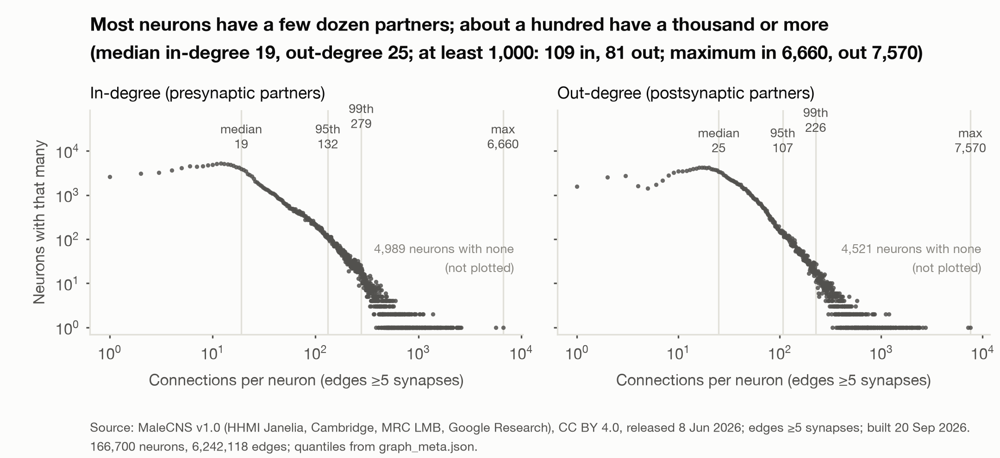

# Intelligence Is Structure, Not Scale: A Whole Central Nervous System Connectome as a Fixed Substrate for Scoring Health Data Trust

**Jason Alan Snyder**¹

¹SuperTruth Inc., United States. ORCID 0009-0001-6157-8100

**Correspondence:** through the SuperTruth contact form, https://supertruth.ai/on-the-record#contact

**Submitted:** September 2026

**DOI:** https://doi.org/10.5281/zenodo.22865214 (all versions; each version also carries its own DOI on the Zenodo record). **Dataset:** https://doi.org/10.5281/zenodo.22865020.

---

<!-- STATUS: v1.2 complete (2026-09-22). Front matter, plain-language opener, attribution, intended use, COI, footer are SETTLED
     (legal flags 1 to 13 applied). Sections 3 to 6 are filled from PROTOCOL.md and the run results; no number appears here that was
     not produced by a run. Version 1.2 = the complete pre-registered protocol (seeds 1 to 5, both tasks, all five arms; render_results.py --version 1.2)
     and the post-hoc examples arm (g2) for all four vendors; decision rules carry PASS/FAIL verdicts at five seeds; the live spot check and the
     window-cap parity check are SKIPPED with reason.
     BUILD: ./build.sh reproduces the DTI paper's look (pandoc standalone HTML -> headless Chrome PDF). -->

## Abstract

<!-- TODO-RESULTS: fill from results.json; keep to 200 words; last sentence fixed below. -->

We took the wiring diagram of a fruit fly's central nervous system, held every connection and sign fixed, and trained only synaptic gains, an input projection and a readout. The task: reproduce two SuperTruth trust scores, the Data Trust Index™ (DTI) on health records and the Behavioral Integrity Index (BII) on agent event logs. Controls: a shuffled graph, a random graph, a parameter-matched network, a linear readout, and four frontier models (Claude Opus 5, GPT-5, Grok 4, Gemini 3 Flash) given the published DTI paper and the same records. <!-- RESULTS-ABSTRACT-START -->Over five seeds, the degree-preserving shuffle matched the fly's wiring against the DTI engine (composite error 1.60 against 1.74 points (95% CI -0.45 to +0.17)); the random graph matched on tier agreement and every dimension. Every fixed graph beat the parameter-matched network by 1.9 to 2.1 points: at five seeds, the substrate carries the computation. On 300 identical records the four models matched the engine's tier on 20% to 45% at 13 s to 73 s and 4 to 26 cents per record; the fly, 84% at 16 ms and no marginal cost. Given 100 engine-scored examples as well (post-hoc), they matched on 54% to 76%.<!-- RESULTS-ABSTRACT-END --> To our knowledge, as of 20 September 2026, this is the first reported use of a whole central nervous system connectome to score the trustworthiness of health data. Every record was synthetic; no real person's data was used. Simply put, the future of intelligence is analog.

**Keywords:** connectome, Drosophila, MaleCNS, fixed-substrate learning, data trust, Data Trust Index, Behavioral Integrity Index, health data integrity, auditable AI, analog intelligence

**ACM CCS:** Computing methodologies → Machine learning → Learning paradigms; Applied computing → Life and medical sciences → Health informatics; Computing methodologies → Bio-inspired approaches

---

## Prologue

I have been saying for years [43, 46, 47] that the future of intelligence is biological and quantum [35, 36, 37, 39, 50]. Electrons alone will only take us so far [35, 38]. The machines we call large language models are marvels, and they are also what I have called kerplinko machines, a phrase borrowed from my friend and mentor John Kheit, after pachinko [43, 48, 49]: drop a token in at the top, let it rattle down through billions of pins, and see where it lands. And the pins were placed by the internet, which rewards what spreads over what is true. A machine that boots from that inherits the bias at the kernel. The fly's wiring was placed by a world that does not care what is popular.

A parent helps the boot sequence. In the beginning you feed the child its core kernel, and only later does it learn and adapt on its own. Harlow showed what happens to infant monkeys raised with nothing to hold: they never recover, however much they learn afterward [34]. The first thing a machine is fed is not one input among many. It is the kernel.

Curation is part of creation. It sets the kernel. Establish a good kernel and the sky is the limit. Very few are bothering with that. We are.

The machines are enormous, hot, and repetitive, running the same colossal computation over and over to produce each word. Set one beside a fruit fly, an animal we swat without a thought, and compare the architecture and the appetite. The fly wins on both. Its brain and nerve cord have 166,700 neurons and run on almost nothing. No engineer designed it. It was refined over hundreds of millions of years by a process that does not tolerate waste.

There is a warning in that comparison. We should be careful about what we choose to abdicate control to, and I have written about that elsewhere [43, 44, 45]. But it is not the point of this experiment.

The point of this experiment is simpler. The design of nature is not to be diminished, and not to be relegated to a footnote beneath our newest technology [40, 41, 42]. We took a complete nervous system, exactly as nature built it, and asked it to do one of the hardest jobs in health data. What it did and did not do is in the pages that follow. Whatever the number says, the lesson holds. We have much more to learn from nature. In fact, everything.

Jason Alan Snyder, September 2026

---

## Why we did this

The dominant assumption in health AI is that a model's judgment can be trusted because the vendor says so. That is not trust. It is deference. A frontier model is billions of numbers no one has read, trained on text no one has audited, producing a score no one can trace back to a reason. When a hospital asks why a record was rated safe to use, the honest answer is that nobody knows.

The problem is structural. You cannot audit what you cannot see, and every large model is built to be unseen.

A fruit fly's nervous system is the opposite object. In 2026 the complete wiring of one animal's brain and nerve cord became public [1]: every neuron, every connection, each one observed under an electron microscope, typed, and labeled with the chemistry it uses. Nothing in it was trained. Nothing in it was guessed. It is a mind whose every part is a published fact.

So we borrowed it. The release lists 211,577 reconstructed cells; 166,700 of them are classified neurons, and we used every one. Between those neurons it records 25.6 million connected pairs, and we kept the 6,242,118 joined by five or more synapses, the threshold the FlyWire analyses use to separate reliable connections from ones a single misplaced synapse could create [2]. We moved none of them. We trained only how loudly each connection speaks, where a health record enters, and where the score is read out. Then we asked it to do our job: reproduce the Data Trust Index on health records and the Behavioral Integrity Index on agent event logs. And we made it compete: the same wiring shuffled, a random graph of the same density, a conventional network with the same number of trainable parameters, a linear readout, and four frontier models handed our published paper and the same records.

If the fly's wiring does the job, the judge has 6,242,118 connections and every one of them can be looked up. Trust stops being a vendor's claim and becomes a property you can audit.

If evolved wiring beats the same wiring shuffled, structure carries computation on its own. Bigger is not the only direction.

A large model runs the same enormous computation for every token it emits, and it emits hundreds of tokens to score one record. It keeps doing the same thing over and over. A fly's wiring had hundreds of millions of years of selection to stop doing that. Our run is a digital simulation, so we claim nothing about the animal's energy. We count the work instead: about a hundred million multiply-adds per record, and how many neurons fire at each step.

This judge is small, deterministic, runs on a laptop, and has never read the internet. The record does not leave the room, and it cannot have been memorized.

We publish the result either way. We wrote the controls and the decision rules before the first run, and a wiring that fails is a fact worth having.

Models are other people's business. Ours is whether the thing judging your data can itself be judged. Intelligence is structure, not scale. We borrowed a brain to prove it.

---

## 1. What we did, in plain English

A fruit fly's brain and nerve cord have been mapped completely: every neuron, every connection, published free for anyone to use [1]. It is not software. It is a map made with an electron microscope. Every connection is a physical fact you can look up, with a named cell type and the chemical it uses.

We used every one of its 166,700 classified neurons and kept the 6,242,118 connections joined by five or more synapses, the threshold that screens out connections a single misplaced synapse could create. We moved none of them. We tuned three things only: how loud each connection is, where a health record enters, and where the score comes out. Then we asked the fly's wiring to reproduce our trust scores and compared it with the same wiring shuffled, a random graph of the same density, a same-size conventional network, a linear readout, and four frontier models reading our published paper.

A chatbot is a library with the doors welded shut. The fly brain is a circuit board with every trace labeled and the schematic published.

We are not saying a fly is smarter than a chatbot. We are not treating patients. Every record was synthetic. If the wiring does not matter, Section 4 says so. If you are asking whether it is fair to compare a circuit trained on our scores with a model that only read our paper, it is not, and the paper does not pretend it is; Section 5 says what the comparison is for and what it is not. To our knowledge, as of 20 September 2026, nobody has asked a trust question of a brain that can be read cover to cover.

---

## 2. Background

### 2.1 The connectome

A connectome is a wiring diagram recovered from electron microscopy: every neuron traced, every synapse located, every connection counted. FlyWire, which its authors describe as the first wiring diagram of a whole adult brain [2], is the brain of one adult female *Drosophila melanogaster*, published in 2024 with about 140,000 neurons and about 50 million synapses [2] and a cell-type annotation for every neuron [3]. Two companion results made that wiring usable as a computing substrate. Eckstein et al. predicted the neurotransmitter each neuron releases from the electron microscopy images of its synapses [4], and Shiu et al. built a leaky integrate-and-fire model of the whole brain on the connectome, with synaptic signs taken from those predictions, that reproduced known sensorimotor behavior [5]. We inherit that sign convention.

The substrate used here is MaleCNS version 1.0, the complete central nervous system of one adult male fly, brain and ventral nerve cord in one reconstruction, so that sensory, descending, and motor neurons are all present. It was produced by the FlyEM team at HHMI Janelia with the University of Cambridge, the MRC Laboratory of Molecular Biology, and Google Research, and is described by Berg et al. [1]. Companion papers cover the male optic lobe [6], the organization of visual pathways [7], the gustatory system [8], and the sexually dimorphic circuits for social behavior [9]. Google Research announced the release on 3 September 2026 [10]. The data are licensed CC BY 4.0 (see Connectome Attribution).

Table 1 gives the counts we measured from the release files on 20 September 2026 under the rules in Section 3.1. Our neuron rule, a body with a non-null superclass, keeps nine more bodies than the release's own neuron count. We report our figure with its rule and never the published figure as ours. The graph keeps neuron pairs joined by at least five synapses; a pair is one edge whatever its synapse count.

**Table 1: The MaleCNS v1.0 substrate as measured (data/malecns/graph_meta.json, 20 September 2026; release files from Berg et al. [1])**


| Quantity | Value | Rule |
|---|---|---|
| Bodies in the annotation table | 211,577 | all rows |
| Neurons kept (N) | 166,700 | non-null superclass |
| Neuron-to-neuron pairs, any weight | 25,582,938 | carrying 124,177,617 synapses |
| Edges kept (E), weight ≥ 5 | 6,242,118 | carrying 89,860,280 synapses; 0 duplicate pairs |
| Excitatory share | 62.80% of edges, 61.96% of synapses | presynaptic acetylcholine |
| Edges from a neuron with a signed transmitter | 97.72% | acetylcholine, GABA, glutamate, histamine; 0.80% modulatory, 1.48% unclear |
| Neurons with no edge at this threshold | 864 | either direction |
| Sensory neurons | 17,937 | input set |
| Descending neurons | 1,316 | readout set |
| Motor neurons | 815 | readout set |


**Figure 1: Every neuron of the substrate at its recorded position, three orthographic projections (dorsal, lateral, front) at one scale.** Blue: the 17,937 sensory neurons that receive a record. Orange: the 1,316 descending and 815 motor neurons the score is read from. Grey: the 146,632 fixed neurons between them. Every marker is the same size. Positions: soma location for 139,662 neurons, tracing-to-soma location for 976, and the centroid of the neuron's own synapses for 25,941 (mostly sensory neurons whose cell bodies lie outside the imaged volume); 121 neurons have no recorded position and are not drawn. Source: MaleCNS v1.0 body annotations and synapse table [1], CC BY 4.0; SuperTruth derived graph, 20 September 2026.

### 2.2 Connectome-constrained and fixed-substrate models

Two lines of prior work make a fixed wiring diagram a plausible learning substrate. The first is connectome-constrained modeling. Lappalainen et al. built a deep mechanistic network of the fly visual system whose connectivity was fixed to the connectome and whose synaptic gains were trained on a task, and found that it predicted the responses of single neurons it had never been fit to [11]. Morra and Daley used a fly connectome as the frozen reservoir of an echo state network and ablated its sparsity, its weights, and its clustering [12]. The whole-brain model of Shiu et al. [5] and the whole-body physics simulation of Vaxenburg et al. [13] show connectome-era fly models driven by learned controllers. None of these scores data.

The second line is the theory of learning on a substrate you do not train. Echo state networks [14, 15] and liquid state machines [16] fix a recurrent reservoir and train only a linear readout. Random features [17, 18] and extreme learning machines [19] fix a random first layer and fit the rest, with approximation guarantees for the trained readout. Weight-agnostic networks perform tasks with a single shared weight, so the architecture alone carries the function [20]. Randomly weighted networks contain untrained subnetworks that already perform well [21], and the lottery ticket hypothesis finds sparse subnetworks, fixed at initialization, that train to full accuracy [22]. All of these use random or searched structure. The question here is whether evolved structure does at least as well as its own randomization.

Dale's principle, that a neuron releases the same transmitter class at all of its synapses [23, 24, 25], is what lets a connectome carry signs: the presynaptic neuron's predicted transmitter fixes whether each connection excites or inhibits. Cornford et al. showed that networks trained under this sign constraint need not lose accuracy [26]. We keep every sign fixed and learn only a positive gain per connection, so Dale's principle holds by construction.

The research question is therefore precise. Hold the MaleCNS wiring and its signs fixed; train gains, biases, leaks, an input projection into the sensory neurons, and a readout from the descending and motor neurons; and ask whether the reconstructed wiring carries task-relevant structure beyond its degree sequence and its density. A degree-preserving shuffle keeps every neuron's in-degree and out-degree, every synapse count, and every sign, and destroys only who connects to whom. A random graph of the same size keeps only the density. If the real wiring does not beat both by a margin stated before the first run, the answer is no, and we say so.

### 2.3 The public story that prompted this work
On 19 September 2026 the New York Post reported that a fruit fly connectome model beat Claude Opus 5 at chess in eleven moves, quoting the model's author, Maxime Labonne. The model card for that model (mlabonne/chessfly) reports a 30.4% match rate against Stockfish's top move and does not mention Claude Opus 5 or publish a game record; we have not found one. We take no position on that game. Those chess models were built on the FlyWire FAFB connectome, not on the MaleCNS release used here, and we did not download, run, or derive from either model or from any FlyWire or FAFB data.

### 2.4 The two trust scores
DTI is a record-level integrity score, 0 to 100, over eight weighted dimensions (Provenance 25, Consent 20, Recency 15, Quality 10, Concordance 10, Validation 10, Breadth 5, Stability 5) with four operating tiers [27]. This paper describes DTI only to the extent the published paper does. BII is VIGIL's score, 0 to 1, of a software agent's behavioral integrity computed from its event log, with a four-state gate. BII's scoring mechanism is not described here; it is used as a black-box teacher. DTI and BII are proprietary to SuperTruth Inc.

---

## 3. Methods

This section renders the pre-registered protocol (docs/PROTOCOL.md, v0.1, 20 September 2026), the decision log that amends it (docs/DECISIONS.md), and protocol amendment 1 (docs/PROTOCOL-AMENDMENT-2026-09-20.md), which makes the committed code the binding specification where the two differ. Nothing in it was written after seeing a result. Every number is measured from a file on disk on 20 September 2026 or is a threshold committed before the first run. Where a number did not yet exist when this text was drafted, it was filled from the run files by scripts/splice_paper.py and carries a run marker in the source; the two checks that were not run before the frozen clock day ended are marked SKIPPED with the reason. Code, the derived graph, the DTI feature specification, the protocol, the decision rules, every run manifest, the synthetic corpora with the DTI labels, and the DTI-trained parameters are released; the BII labels, the BII-trained parameters and the BII feature specification are held (see Data and Code Availability).

### 3.1 Graph construction

Three release files were downloaded from the public MaleCNS v1.0 bucket on 20 September 2026: body annotations at minimum confidence 0.5, per-body neurotransmitter predictions, and the neuron-to-neuron weights table. Their sha256 digests are in data/README.md. Algorithm 1 builds the graph.

**Algorithm 1: Graph construction (data/build_graph.py)**

```
Input:  annotations (bodyId, superclass); transmitters (body, consensus_nt);
        weights (body_pre, body_post, weight); threshold θ = 5;
        policy for edges from modulatory and unclear presynaptic neurons
Output: frozen CSR graph (indptr, indices, syn_count, edge_sign), role masks, sha256

1.  N ← bodies with a non-null superclass                        // 166,700 of 211,577
2.  rows ← weights rows with body_pre ∈ N and body_post ∈ N
3.  drop rows with body_pre = body_post                            // 101 self-loops in the raw table
4.  E ← rows with weight ≥ θ, one edge per (pre, post) pair        // 6,242,118; 0 duplicate pairs
5.  sign(i) ← +1 if consensus_nt = acetylcholine
             −1 if consensus_nt ∈ {GABA, glutamate, histamine}
             modulatory if ∈ {dopamine, octopamine, serotonin}
             unclear if the prediction is "unclear" or missing
6.  edge_sign(i, j) ← sign(i)                                      // Dale's principle
7.  edges with sign(i) ∈ {modulatory, unclear} ← policy
        primary: plus (+1, the nfly convention; 0.80% + 1.48% = 2.28% of E); ablation: zero (gain fixed at 0)
8.  Sensory ← superclass ∈ {ol_sensory, cb_sensory, vnc_sensory, sensory_ascending,
                            sensory_descending, and their _tbc variants}          // 17,937
    Descending ← {descending_neuron, descending_neuron_tbc}; Motor ← {vnc_motor, cb_motor}
    Readout ← Descending ∪ Motor                                   // 1,316 + 815 = 2,131
9.  isolated ← neurons with no edge in either direction            // 864; kept in N, never coupled
10. freeze (indptr, indices, edge_sign, Sensory, Readout); record the graph sha256 in every footer
```

Signs follow Dale's principle applied to the presynaptic neuron's consensus transmitter [5, 4, 26]. Of 166,700 neurons, 103,720 are predicted cholinergic, 29,302 glutamatergic, 22,069 GABAergic, 7,891 histaminergic, 3,177 unclear, 392 dopaminergic, 101 octopaminergic, and 48 serotonergic. Glutamate and histamine are treated as inhibitory because in the fly they act mainly through chloride channels; this is a modeling choice (assumptions log, A3), bounded by the ablation row in Section 3.5, not a measurement. Modulatory and unclear presynaptic neurons have no defensible sign. The graph as built (data/build_graph.py, defaults `--modulatory plus --unclear plus`) signs their edges +1, the convention of the nfly reference model: 0.80% of E from dopamine, octopamine, and serotonin neurons and 1.48% from neurons with an unclear or missing prediction, 2.28% together (A4, amendment 1 row 6). Zeroing those edges is an ablation the code supports and the pilot does not run. The 864 neurons with no edge at this threshold remain in the index with their own bias, leak, and homeostatic gain; they receive no input and reach no readout.

The threshold is five synapses; threshold 3 yields 10,511,038 edges and threshold 10 yields 2,769,379. It is chosen once, before the first training run, by the feasibility gate in Section 3.2, is identical across arms a, b, and c, and is written with a timestamp to graph_choice.json before the first training ledger entry (rule 30). Edge, synapse, and role counts do not depend on the sign policy, so Table 1 holds under either. Digest of graph_meta.json as built (plus/plus policy), carried in every run manifest: d043ac552fd6eb22833eda020224a44497a7b3cd10de4fc79388db8b7be8b952.



**Figure 2: In-degree and out-degree of the built graph on log-log axes, two small multiples at one scale.** Quantiles from data/malecns/graph_meta.json are marked on the axes; 109 neurons have in-degree of 1,000 or more and 81 have out-degree of 1,000 or more; 864 neurons are isolated at the five-synapse threshold. Source: MaleCNS v1.0 [1], edges of at least five synapses, computed 20 September 2026.

### 3.2 Model

Every graph arm shares one leaky rectified-rate recurrence (flytrust/model.py, class ConnectomeNet), unrolled for T = 8 synchronous steps:

h₀ = 0

uₜ,ᵢ = νᵢ · Σⱼ sᵢⱼ · gᵢⱼ · hₜ,ⱼ + bᵢ + 1[i ∈ Sensory] · (P x + p₀)ᵢ

h₍ₜ₊₁₎,ᵢ = (1 − aᵢ) · hₜ,ᵢ + aᵢ · relu( γᵢ · uₜ,ᵢ )

y = R · h_T[Readout] + r₀

Here sᵢⱼ ∈ {−1, +1} is the fixed edge sign from Algorithm 1. The edge gain is gᵢⱼ = softplus(θᵢⱼ) · exp(λ), with one trainable θᵢⱼ per edge and one trainable global log-scale λ; θ is initialized so that gᵢⱼ = log1p(synapse count) at λ = 0. Softplus keeps every gain positive, so no edge can flip sign (rule 12), and log1p avoids the log of zero. νᵢ is a fixed per-neuron constant, the reciprocal of the neuron's total incoming gain at initialization, νᵢ = 1 / Σⱼ log1p(synⱼᵢ) (the code's `total_gain` normalization); it adds no degree of freedom, and at initialization it makes each pre-activation a signed weighted average of its inputs, so with a rectifier and a leak in (0, 1) activity stays bounded by the sensory drive for any T. The alternative 1/√(in-degree) scaling was measured and rejected before any label was seen: because 62.80% of edges are excitatory, hubs amplify several-fold per step, and the hidden norm on the 2,000 highest-degree neurons grew from 4.0 after step 1 to 1.4 × 10⁶ after step 8; it remains in the code as an ablation option. bᵢ is a per-neuron bias initialized to 0; aᵢ = sigmoid(lᵢ) is a per-neuron leak with lᵢ trainable, initialized so aᵢ = 0.5; γᵢ is a per-neuron homeostatic gain initialized to 1; P (|Sensory| × d_in) with bias p₀ projects the feature vector x into the sensory neurons only; and R (d_out × |Readout|) with bias r₀ reads the descending and motor neurons after the last step. Nothing else is trainable. Edge indices, signs, and νᵢ are buffers without gradients whose joint digest is checked before and after every epoch (rule 11).

The per-edge sum is computed by the released `edgeops.signed_aggregate` as a padded segment sum over edges sorted by postsynaptic neuron and bucketed by in-degree, not by a scatter-add, because atomic float adds on Apple's MPS backend return different bits on every call; a reduction over a fixed view has a fixed order, so every forward pass is bitwise reproducible, and the trainer asserts this after every epoch by running the same batch twice.

The trainable count is E + 1 + 3N + |Sensory| × (d_in + 1) + d_out × (|Readout| + 1). For the threshold-5 graph with the DTI heads (d_out = 14) at d_in = 64, the released speed bench prints 7,937,972 trainable parameters (runs/bench_speed.json, `count_parameters()`). The shuffle and random-graph arms are the same module on a surrogate graph with the same N, E, sensory set, and readout set, so their count equals the connectome arm's exactly, by construction. The count at each task's released feature width, read from run.json: <!-- RUN: count_params() per arm and task -->7,955,909 for arms a to c on DTI (d_in = 65, d_out = 14), 7,811,162 on BII (d_in = 58, d_out = 5), 7,953,594 for the matched network on DTI, and 7,813,769 for the matched network on BII (runs/{task}/{arm}/seed1/run.json)<!-- /RUN -->.

**Heads.** The readout is one linear map whose output is split into heads (model.py, `OutputSpec`). DTI, d_out = 14: the eight dimension scores (regression, 0-100 scaled to the unit interval); the composite (regression, predicted directly, and also recomputed from the predicted dimensions with the engine's weights and rounding; both reported); the tier (five-way softmax over BELOW THRESHOLD, BRONZE, SILVER, GOLD, PLATINUM). BII, d_out = 5: the score (regression, 0-1) and the gate (four-way softmax over pass, hold, alert, collapse). Under the black-box ruling on BII (DECISIONS.md, Q9) these are the only BII heads.

**Training.** Arms a to d train with the released trainer (flytrust/train.py) under the settings the run script pins for every gradient arm (scripts/run_arm.py): AdamW with a single learning rate of 1e-3 for every trainable tensor, weight decay 0.01, cosine decay to zero over the maximum epoch budget with no warmup, and the gradient norm clipped at 1.0; T = 8; at most 20 epochs with early stopping on validation loss at patience 3, the best validation checkpoint kept; loss = squared error on the dimensions + squared error on the composite + cross-entropy on the tier (DTI), or squared error on the score + cross-entropy on the gate (BII), regression targets scaled to the unit interval. The batch size B is measured once by scripts/measure_batch.py and read from runs/batch_choice.json: <!-- RUN: B from runs/batch_choice.json -->B = 64, measured 2026-09-20T15:42:46Z at d_in = 65: 128 was not at least 5% faster per record (76.9 against 76.1 records per second), so 64 is kept<!-- /RUN -->. Realized epochs and the checkpoint kept, per finished run: <!-- RUN: realized epochs and best checkpoint per finished run -->BII seed 1: fly wiring (a) stopped after 16 epochs, checkpoint from epoch 12, random graph (c) stopped after 16 epochs, checkpoint from epoch 12, matched network (d) stopped after 11 epochs, checkpoint from epoch 7, shuffle (b) stopped after 16 epochs, checkpoint from epoch 12; BII seed 2: fly wiring (a) stopped after 16 epochs, checkpoint from epoch 12, random graph (c) stopped after 16 epochs, checkpoint from epoch 12, matched network (d) stopped after 15 epochs, checkpoint from epoch 11, shuffle (b) stopped after 16 epochs, checkpoint from epoch 12; BII seed 3: fly wiring (a) stopped after 14 epochs, checkpoint from epoch 10, random graph (c) stopped after 13 epochs, checkpoint from epoch 9, matched network (d) stopped after 10 epochs, checkpoint from epoch 6, shuffle (b) stopped after 14 epochs, checkpoint from epoch 10; BII seed 4: fly wiring (a) stopped after 17 epochs, checkpoint from epoch 13, random graph (c) stopped after 11 epochs, checkpoint from epoch 7, matched network (d) stopped after 13 epochs, checkpoint from epoch 9, shuffle (b) ran the full budget; BII seed 5: fly wiring (a) stopped after 15 epochs, checkpoint from epoch 11, random graph (c) stopped after 13 epochs, checkpoint from epoch 9, matched network (d) stopped after 13 epochs, checkpoint from epoch 9, shuffle (b) stopped after 16 epochs, checkpoint from epoch 12; DTI seed 1: fly wiring (a) stopped after 16 epochs, checkpoint from epoch 12, random graph (c) stopped after 13 epochs, checkpoint from epoch 9, matched network (d) stopped after 8 epochs, checkpoint from epoch 4, shuffle (b) stopped after 16 epochs, checkpoint from epoch 12; DTI seed 2: fly wiring (a) stopped after 14 epochs, checkpoint from epoch 10, random graph (c) stopped after 11 epochs, checkpoint from epoch 7, matched network (d) stopped after 8 epochs, checkpoint from epoch 4, shuffle (b) stopped after 14 epochs, checkpoint from epoch 10; DTI seed 3: fly wiring (a) stopped after 15 epochs, checkpoint from epoch 11, random graph (c) stopped after 11 epochs, checkpoint from epoch 7, matched network (d) stopped after 6 epochs, checkpoint from epoch 2, shuffle (b) stopped after 15 epochs, checkpoint from epoch 11; DTI seed 4: fly wiring (a) stopped after 10 epochs, checkpoint from epoch 6, random graph (c) stopped after 10 epochs, checkpoint from epoch 6, matched network (d) stopped after 8 epochs, checkpoint from epoch 4, shuffle (b) stopped after 14 epochs, checkpoint from epoch 10; DTI seed 5: fly wiring (a) stopped after 12 epochs, checkpoint from epoch 8, random graph (c) stopped after 10 epochs, checkpoint from epoch 6, matched network (d) stopped after 10 epochs, checkpoint from epoch 6, shuffle (b) stopped after 18 epochs, checkpoint from epoch 14 (run.json counts epochs from 0; "stopped" means validation loss had not improved for 3 epochs, the pre-registered patience)<!-- /RUN -->. Data order within an epoch is drawn from a generator seeded with the run seed. Every setting is written to run.json. Arm e is fit in closed form and is not trained by gradient. Checkpoints are chosen on validation only; the test split is read once per (task, arm, seed) by scripts/run_arm.py from the best checkpoint, the read is recorded in runs/eval_ledger.jsonl, and a second read is refused without a written reason (rule 9).

**Hardware and feasibility gate.** One Apple M4 Max, 64 GB, PyTorch MPS (torch 2.14.0). Before any training, one forward and backward pass at batch 64 and T = 8 on the threshold-5 graph must finish within 2.0 s wall clock and fit in memory; if not, the whole protocol moves to the threshold-10 graph and says so. Measured by the released bench (runs/bench_speed.json, d_in = 64): median training step 0.834 s at batch 64, forward 16.1 ms per record at batch 1 and 4.34 ms per record at batch 256, 20.8 GB of device memory after the training step, 8,914,095 padded edge slots for 6,242,118 edges; the gate passes and the threshold-5 graph is kept. The share of readout neurons reachable from the sensory set within T hops must be at least 0.90 or T is raised before the freeze (rule 13): <!-- RUN: readout reachable share within T -->0.9962: 2,123 of the 2,131 descending and motor neurons lie within 8 directed hops of a sensory neuron, and the other 8 have no path from the sensory set at any length; 166,289 of all 166,700 neurons (0.9975) are within 8 hops and 411 are unreachable. The median shortest path from the sensory set to a readout neuron is 1 hop and the longest 3 (readout neurons by hop count: 1,164 at 1, 943 at 2, 16 at 3). The synchronous update delivers input to a neuron d hops away at step d + 1, so the readout after T = 8 steps carries input from every neuron within 7 hops, the same 0.9962 (scripts/reachability.py, results/reachability.json)<!-- /RUN -->.

### 3.3 Synthetic data

No real person's data and no production traffic are used. Every record is generated by code from a seed.

**DTI corpus.** One corpus of 20,000 records, each an independent draw from the released generator (teachers/gen_dti.ts) with seed 20260920 and a per-row key derived from the seed and the row index, so the file reproduces byte for byte. The generator was built from the engine's input surface: one knob per extracted field and per context field of Section 3.4, each sampled from a distribution stated in the generator's docstring, so the records span every tier and every input the engine reads (DECISIONS.md, Q4). A record is the rendered text plus the context object; the record identifier is the row index, and the released test checks that it does not predict the label (Section 3.6). There are no base patients, no variants, and no corruption modes: rows share no identifier, so identical feature vectors are the only near-duplicates that exist. Every arm, including the language models, sees the same records, so no single student is taught to the test.

**BII corpus.** One corpus of 20,000 event windows, each an independent draw from the released generator (teachers/gen_bii.py) with seed 20260920. A window's latent degradation parameters are drawn once and stamped on it; it holds events of the four types the scorer reads, at most 50 per type, as the live service trims (Section 3.4). Windows share no agent, so no window overlaps another. Each gate state (pass, hold, alert, collapse) holds at least 8% of windows; the further coverage condition on the scorer's internal state that the protocol states is, under the black-box ruling on BII, not described here.

**Not built in this version.** The protocol also named a schema-only out-of-distribution corpus (an eight-field health-shaped record schema with three corruption modes, planned at 24,000 rows) whose split by generator group would have given a transfer table. It was not built; the out-of-distribution check is dropped from this version and is future work (amendment 1, rows 14 and 15).

**Stamping and calibration.** Every DTI row carries its record identifier, the generator seed, the knobs it was drawn from, the engine's extracted fields and scoring context, the eight dimensions, the composite, tier, and flags, the 65-float feature vector, the exact text the engine read, and that text's sha256; every BII row carries its window identifier, seed, latent parameters, per-type event lists, score, gate, the 58-float vector, and the events' sha256 (teachers/MANIFEST.md). Each corpus file is content-addressed and its sha256 appears in every footer; every caption carries the word SYNTHETIC (rule 25). The corpora are not calibrated to any real population, and nothing in this study claims they resemble real health data or real agent traffic; they are calibrated to the teacher: each of the five tiers holds at least 8% of DTI records (realized 8.85% to 30.75%), every dimension has a teacher standard deviation of at least 5 points (realized minimum 12.4), and each of the four gate states holds at least 8% of BII windows (realized 20.59% to 29.87%). Per-split counts are in Section 3.6.

**Feature vectors.** The student arms a to e read a fixed vector per record, built by the released specifications teachers/dti_features_spec.md (65 floats) and teachers/bii_features_spec.md (58 floats). Both are built only from what the engine reads: for DTI, the engine's own extracted-field structure and its scoring context; for BII, the per-type event payloads of one window and each event's monitored-at-time flag. Nothing from the label side (scores, tier or gate, flags, notes, or the scorer's internal statistics) and none of the generator's hidden knobs enter either vector. The DTI vector starts at the engine's extracted fields, so the text-extraction layer sits upstream of teacher and student alike and the student learns the scorer, not the extractor; the sha256 of each specification appears in every footer.

### 3.4 Teachers

**DTI teacher.** The scoring engine deployed behind `POST https://supertruth.ai/api/v1/score`, called in process at engine commit e4785726 (teachers/MANIFEST.md; branch main, worktree clean for the scoring module). Labels were generated once with seed 20260920. The module's sha256 is written to teacher_pin.json and compared at run time; a mismatch halts the run (rule 27). Its weights (Provenance 25, Consent 20, Recency 15, Quality 10, Concordance 10, Validation 10, Breadth 5, Stability 5) equal Table 1 of the published paper [27]; no custom profile is used. The composite is the engine's own rounding of the weighted sum, copied rather than re-derived, and the engine emits five tiers: PLATINUM at 90 and above, GOLD 80-89, SILVER 70-79, BRONZE 55-69, and BELOW THRESHOLD under 55; the published paper lists four, the fifth is a real output, and the student predicts five. SuperTruth operates more than one DTI scoring configuration; the teacher is the one whose weights equal the published paper.

The engine reads one hidden input, the wall clock, in its recency and consent-age computations, and is a pure function of the record only once that clock is frozen. Every teacher call runs with the engine's clock stubbed to AS_OF = 2026-09-20T00:00:00Z, the same AS_OF computes every days-since feature, and AS_OF appears in every footer. Scoring 500 records three times must give zero mismatches (rule 5). A live check scores 50 records through the public endpoint, from SuperTruth's own sandbox tenant, on the UTC day of AS_OF; every dimension, the composite, and the tier must equal the local teacher exactly, and any mismatch halts the run as engine drift. Off that day the check is reported SKIPPED, never PASSED: SKIPPED: the live API spot check was not run before the frozen clock day (2026-09-20 UTC) ended; the offline teacher at the pinned commit is the reference for every label; a live check on a later day would disagree on Recency by design (rule A8).

The student's input is the engine's own extracted-field structure plus its scoring context, encoded as a fixed vector of 65 floats by the released specification teachers/dti_features_spec.md (sha256 in every footer), which lists every slot with its meaning, range, and the engine line it feeds. The slots, in groups: source-system family (7 one-hot) and the record-format flag; capped counts of facilities, provider identifiers, and providers; presence bits for the patient name, date of birth, and identifier; log1p counts of medications, diagnoses, and laboratory results and a capped count of coded diagnoses; consent found, consent dated, and log1p consent age against AS_OF; most recent date present, log1p days since it against AS_OF, and log1p date span; the conflict flag; data types present (10) and expected (8); the recency window (4); an element-score summary (7 slots: count, mean corroboration, typed share, mean source trust, dated share, mean and worst recency ratio); and counts by source-consent level (5) and consent-scope level (6). Fields the engine extracts but never reads (sex, page and character counts, the name strings) are excluded; the vector starts at the extracted fields, so the student learns the scorer, not the text-extraction layer, which sits upstream of teacher and student alike and is not described here. The released `Standardizer` fits per-feature scaling on the training split only and refuses any other partition (rule 7).

**BII teacher.** BII is a black box: its input is an event window, its outputs are a score and a gate, and its mechanism is not described here; the public description is the VIGIL product page [28]. The teacher is the scorer's detection code at VIGIL commit 1cffd016 (teachers/MANIFEST.md; branch main, worktree clean for the scoring package), assembled exactly as the deployed service assembles it, called offline with no database, labels generated once with seed 20260920, under the seed policy with empty registries: one policy pinned by digest and checked against the scorer's own test constant (rule 17); no authorization or lifecycle registry entries, so payload flags decide; no agent blueprint; no score history. A different policy or a populated registry would need extra inputs and is out of scope; every BII statement in this paper means BII under the seed policy with empty registries. The live service reads an agent's newest 300 events and trims to 50 per type; generated windows never exceed 300 events, so the offline view equals the live view, and 50 replayed windows must reproduce the offline score to four decimals through the service's own test harness (rule 16): SKIPPED: the offline BII replica caps windows exactly as the live path does by construction (300-event fetch, 50 per type); a live parity check was not run. The student's input is a fixed encoding of one window as 58 floats (teachers/bii_features_spec.md, sha256 in every footer): per-type event counts scaled to the 50-per-type cap, shares of events by their payload flags and codes (authorization, initiator, operation, asset, monitored-at-time), and summary and order statistics of the numeric payload fields. The specification states which of the scorer's inputs the vector carries exactly and which only in summary; that division is part of the released specification, not of this paper.

### 3.5 Arms

All arms train on identical splits and seeds. Arm a is the claim; b and c are the null substrates that separate wiring from degree sequence and density; d is the parameter-matched control, e the floor, f the ceiling, g the language models of Section 3.8. The rows below the line are sensitivity and exploratory runs and drive no claim.

**Table 2: Arms**

| Arm | Substrate or model | Trainable parameters | Notes |
|---|---|---|---|
| **a** | MaleCNS graph as built (threshold 5, plus/plus policy) | 7,937,972 at d_in = 64 with the DTI heads (runs/bench_speed.json); per task: <!-- RUN: count_params() -->7,955,909 (DTI, d_in = 65); 7,811,162 (BII, d_in = 58)<!-- /RUN --> | the claim |
| **b** | degree-preserving shuffle of a | identical to a | Maslov-Sneppen double-edge swaps (a→b, c→d becomes a→d, c→b), 10 accepted swaps per edge (`swaps_per_edge = 10`); swaps that would create a self-loop, a duplicate edge, or a collision within a batch are rejected; in- and out-degree preserved per neuron; each edge keeps its synapse count and its presynaptic sign; sensory and readout sets unchanged; new shuffle per seed |
| **c** | Erdős-Rényi graph, same N and E | identical to a | edges uniform without replacement, no self-loops, no duplicates; synapse-count multiset permuted onto them; one sign per neuron (Dale's principle) drawn at random, then neurons flipped one at a time until the excitatory edge fraction is within 0.001 of the real graph's 0.628 (measured 0.6271); sensory and readout sets unchanged; new graph per seed |
| **d** | multilayer perceptron, matched parameters | within 2% of a | depth 2 (two rectified hidden layers), width solved so the count matches a: 2,778 at d_in = 64, measured +0.02%; heavily overparameterized on a 65-dimensional input and reported as such |
| **d'** | small multilayer perceptron, 2 × 256 | as built | reference row, not a required arm; queued after the pilot and not run in this version (DECISIONS.md, row "d' control") |
| **e** | ridge regression on the raw feature vector | (d_in + 1) × d_out | the floor; closed-form least squares on the regularized system, intercept not shrunk, class heads fit as one-hot regression and read as logits; λ chosen from {0.01, 0.1, 1, 10, 100} by validation loss and recorded per run |
| **f** | the teacher itself | 0 | the ceiling; error 0 by construction, printed to prove the plumbing |
| **g** | four frontier language models | unknown, unpublished | requested ids `claude-opus-5`, `gpt-5`, `grok-4`, `gemini-3-flash-preview` (amendment 1, row 16); Section 3.8 |
| a-zero | a with modulatory and unclear edges zeroed (`--modulatory zero --unclear zero`) | as a | ablation supported by the code and not run in the pilot (amendment 1, row 6) |
| a-frozen | a with edge gains frozen at initialization | as a minus E | exploratory: does the wiring effect survive without per-edge learning |
| b-block | shuffle within superclass blocks | as a | exploratory: block structure or fine wiring |

For each seed s, b_s and c_s are built from a with seed s, and the released `test_null_graphs_match_degree_and_size` asserts that b matches a on both degree vectors, E, the synapse-count multiset, and every edge's presynaptic sign, and that c matches a on N and E with no self-loops and no duplicate pairs (rule 10). For a given seed, arms a to d start from the same initial P, R, b, g, and leaks and see the data in the same order.

### 3.6 Splits, leakage gate, dataset health, and adversary tests

**Splits.** The protocol's grouping unit is the base record for DTI (a base row and all its clean, corrupted, or variant forms share one base_id) and the agent for BII (all windows of one agent share one agent_id). The teacher files as generated carry neither identifier, since every row is an independent draw (teachers/MANIFEST.md), so identical inputs are the only near-duplicates that exist, and the released splitter (scripts/make_splits.py) takes the group to be the set of rows with an identical feature vector: 20,000 groups for DTI and 19,994 for BII, where seven all-zero windows form one group. Each corpus is split once by group, 70/10/20 into training, validation, and test, stratified on the group's modal teacher class (DTI tier, BII gate), with seed 20260920; the partition is written per run seed as splits/{task}_seed{S}.json, the partitions inside those files are identical by construction, and each file's sha256 appears in every footer. Realized counts, training / validation / test: DTI 13,999 / 2,000 / 4,001; BII 14,000 / 2,000 / 4,000. Every scaler and encoder is fit on the training split (rule 7). The primary comparison is not k-fold because each arm is a full-graph training run and five seeds by four arms by two corpora is the budget; the fixed split, identical across arms, makes every comparison paired.

**Leakage gate.** The checks in Table 3 run and are reported before any score is computed.

**Table 3: Named leakage risks and the released test for each**

| Risk | Why it is real here | Check |
|---|---|---|
| Pair straddle | a clean row and its corrupted twin differ in one to three cells | `test_no_pair_straddle` |
| Window overlap across the split | windows of one agent share events | `test_no_agent_straddle` |
| Generator collisions | seeded generation reproduces rows; the name pool is finite | `test_no_duplicate_records` on the canonical record with the identifier removed |
| Identifier encodes corruption | an ordinal identifier in the record text would carry the assignment | hashed identifiers; `test_id_not_predictive` (AUROC ≤ 0.55) |
| Clock leaks | recency and consent age move with the wall clock | frozen AS_OF; `test_teacher_deterministic` |
| Target in features | composite, tier, or a dimension encoded by accident | `test_no_target_columns_in_features` (names against the engine's output fields; no feature with absolute correlation above 0.999 to a target) |
| Degenerate dimension | a constant target makes its error trivially small | `test_teacher_variance_gate` |
| Scaler fit on the wrong split | z-scoring on the full corpus leaks test moments | `test_scaler_fit_on_train_only` |
| Window-cap mismatch | the offline scorer sees events the live service would trim | generator cap; `test_window_cap_matches_live` |

**Variance gate.** A DTI dimension whose teacher standard deviation across the corpus is under 2.0 points, or a BII output under 0.02, is degenerate: reported as a constant, excluded from per-dimension error claims, and named (rule 8). If fewer than five of eight DTI dimensions are non-degenerate on the DTI corpus, the generator is revised before the freeze: <!-- RUN: degenerate dimension list per corpus, or none -->none for DTI and none for BII (results/results.json dataset health lines; splits/qa_report.json)<!-- /RUN -->.

**Dataset health report.** Fourteen lines attached to every results table, and the only output if any line fails: counts and class histograms per split with training-to-test Kolmogorov-Smirnov distances; duplicates; straddles; identifier AUROC; teacher determinism and the live check; the degenerate list against its floor; the ten largest feature-target correlations; the largest variance inflation factor; missingness; output-range coverage; window-cap parity and policy digest; substrate and graph digests; seed identity across arms; and every digest equal to its footer value.

**Adversary tests.** docs/DECISION_RULES.md lists thirty rules; each names the failure it prevents, the number that proves it, and the check, and each rule is enforced by a named test in the released code (`qa_adversary.py`, one test per rule) that runs after every pipeline cycle and before any table is rendered. The verifier is tested against itself: its self-test must go red on sixteen planted failures (a straddled pair, an unfrozen clock, a second read of the test split, a shuffle with one skipped swap, and a lowered floor among them), and a verifier that passes its own red fixtures stops the run. Floors in baseline.json ratchet upward only; a floor is lowered only by a hand edit in a reviewed commit that states the reason, and this section lists every such edit: None: no floor in the pre-registered thresholds was edited. Twelve DTI records and eight BII windows frozen from a run whose live check passed are recomputed exactly on every cycle (rule 24). Two rules, the sign convention (28) and the population disclaimer (29), have presence checks only and are marked so.

### 3.7 Metrics and pre-registered decision rules

**Metrics.** DTI: mean absolute error (MAE) per non-degenerate dimension, in points; composite MAE on the composite recomputed from the eight predicted dimensions with the engine's weights and rounding (the headline composite) and on the directly predicted head, which is printed beside it in every table; tier accuracy over five classes; macro-F1 over classes with test support of at least 30; expected calibration error (ECE) of the tier softmax over ten equal-mass bins; Brier score over tiers. BII: MAE on the score (× 100); gate accuracy and macro-F1 over four classes; ECE. All on the test split, per seed, then mean and standard deviation across seeds with the intervals of Section 3.9. The recomputed composite is the headline because the engine's own definition is the weighted sum and because, on the first seed, the directly predicted head moved by about a point between neighbouring epochs while the recomputed one did not; that ruling was made after seed 1 was read and is disclosed as such (DECISIONS.md, row "composite head"). It does not touch tier agreement or the per-dimension errors, which are the primary evidence.

**Thresholds.** Table 4 states, before any run, the number that proves each claim and the bar it must clear. DTI bars are tied to the ten-point Silver and Gold tier width; BII bars to the 0.15 hold band.

**Table 4: Pre-registered decision thresholds (docs/PROTOCOL.md, Section 8.1)**

| Claim | Number that proves it | Threshold |
|---|---|---|
| Fly recovers the DTI engine | composite MAE (recomputed head) on the DTI test split, mean over 5 seeds, with 95% CI | MAE ≤ 2.5 points (one quarter of the 10-point Silver/Gold width), CI upper bound ≤ 3.0 |
| same | tier accuracy | ≥ 0.90, Wilson 95% lower bound ≥ 0.88 |
| same | macro-F1 over supported tiers | ≥ 0.85 |
| same | ECE | ≤ 0.05 |
| same | per-dimension MAE on non-degenerate dimensions | ≤ 5.0 points each |
| Fly recovers the BII scorer | BII MAE on the BII test split | ≤ 0.0375 (one quarter of the 0.15 hold band), CI upper bound ≤ 0.045 |
| same | gate accuracy / macro-F1 / ECE | ≥ 0.90 / ≥ 0.85 / ≤ 0.05 |
| Wiring matters (per task) | δ_b = MAE(b) − MAE(a) and δ_c = MAE(c) − MAE(a), composite (DTI) or score (BII) | both ≥ 1.0 point (DTI) or ≥ 0.015 (BII), 95% CI lower bound > 0, and a beats b and a beats c on every one of the 5 seed pairs |
| Fly beats the floor | MAE(e) − MAE(a) | > 0 with CI lower bound > 0; if not, "recovers the engine" is reported as "matches a linear map" and the wiring claim is the only headline |
| Faster, cheaper, or more deterministic than g | p50 latency, dollars per record, determinism share | reported side by side; a claim is made only where the measured gap is at least 10× (latency, cost) or the determinism share of the fly is 1.00 and g's is below 0.90 |

**Procedure.** Build a; for each seed build b_s and c_s from a and assert the match of Section 3.5; train a_s, b_s, c_s, d_s from the same initialization in the same data order; evaluate each on the test split once; compute δ_b and δ_c per seed and pooled; apply Table 4; and print the one sentence the paper may say, chosen from three written in advance and held in the released `sentences.py`: "wiring mattered", "wiring did not matter", or "inconclusive at 5 seeds", the last of which triggers the ten-seed rule of Section 3.9 (rule 22). The a-frozen ablation is run and reported without being claimed. Protocol amendment 1 (docs/PROTOCOL-AMENDMENT-2026-09-20.md), dated 20 September 2026, lists the ten places where the committed code (6fc9540) differs from PROTOCOL.md and makes the code binding; it was written before any test metric was read, and every run manifest carries a start timestamp later than that file's commit.

### 3.8 Language-model arms

Arm g asks four frontier language models to do what the student does, under conditions fixed before any call. The comparison is deliberately asymmetric and the paper says so wherever the numbers appear: the local arms were trained on 13,999 engine-scored records, while the models were given the published description of the method and no scored examples. Teaching the method is how a language model is normally instructed; teaching the scores is how a network is trained. Both were done as well as their setting allows, and the yardstick for both is agreement with the deployed engine, not correctness. Records: N = 300 per task from the test split, stratified by teacher tier (60 per class) or gate (75 per class), sampled with seed 20260920; the identifier list is committed before the first call. Repeats: k = 3 calls per record with the same prompt; Anthropic's API does not accept a temperature under adaptive thinking, and where a vendor accepted temperature 0 the repeats still measure the determinism actually served; each run records the request parameters used. Prompt, frozen and hashed: for DTI, Sections 3 and 4 of the published DTI paper [27] verbatim, the record text, the field table of Section 3.4 as plain text, and a JSON schema for the eight dimensions, composite, and tier; for BII, the scorer's definition documents as the engineering team works from them, the window as JSON, and a schema for the score and gate. The model sees both raw text and structured fields, so it is not handicapped by an extraction stage it cannot see. No examples, no teacher outputs, no hints about implementation quirks. Requested model ids are the ones the site's own comparison harness calls, `claude-opus-5`, `gpt-5`, `grok-4`, and `gemini-3-flash-preview` (amendment 1, row 16), each at its vendor's highest reasoning setting, with a maximum of 16,000 output tokens since thinking tokens count against the cap (amendment 1, row 8); the id requested, the model string the API returned, and whether temperature 0 was accepted are in the table below.

Metrics for g: accuracy on the per-record mean of the three runs and on run 1 alone; determinism as the share of records with an identical tier or gate across runs, the mean composite range, and the per-dimension standard deviation across runs; latency as wall clock per call at the 50th and 95th percentiles; cost as input and output tokens from the API usage object times a price table read at run time (the `claude-api` skill for Anthropic; each other vendor's public pricing page, URL recorded) and stamped with its retrieval date, never from memory (rule 14). Parse failures and refusals count as errors and are reported, not dropped. For arms a to e on the same 300 records: three repeated inferences with bitwise agreement measured, not assumed, since MPS kernels can be nondeterministic (rule 21); latency at batch 1 and batch 256; and dollars per record as $0.00 marginal API spend plus a separately labelled hardware line only if power is measured with `powermetrics`, otherwise "not measured".

**Post-hoc arm g2-examples.** After the four arm g results were read, a second model arm was run at the author's request (amendment 1, row 17). It is identical to g in every respect except the cached system prefix, which carries, after the paper text and before the same instruction block, E = 100 engine-scored records from the training split of seed 1 (record text, the same structured context, and the engine's eight dimensions, composite, and tier), 20 per tier, selected with seed 20260920, identical across vendors and repeats, with zero overlap with the 300 scored records or any test record, asserted before the first call. E is the largest of 50, 100, and 200 that keeps the prefix under 150,000 tokens on every vendor's own tokenizer or count endpoint (llm_arm/examples_budget.json). Its results are reported beside arm g in Section 4.4 and labelled post-hoc; it changes no pre-registered rule and no headline.

**How we ran this.** The table below carries, for each vendor, the id requested, the model string the API returned, the run date, the reasoning setting, whether temperature 0 was accepted, the structured-output mechanism, N and k, the prompt digest, and the price source with its retrieval date, each read from that run's HOW_WE_RAN_THIS.md. Calls were made from SuperTruth's own account with each vendor; no vendor participated in, reviewed, or endorsed this study, and their marks are identified in the Non-Affiliation section. At N = 300 the Wilson 95% half-width is about 0.034 on tier accuracy near 0.9 and about 0.05 on a determinism share near 0.7: enough to rank the arms, not to split hairs, and we do not.

**How the model arms were run (one row per vendor; every cell from the run's HOW_WE_RAN_THIS.md and prices.json; a vendor whose protocol run of N = 300, k = 3 has not finished shows the run that recorded its served model string).** The system prompt is identical across vendors by assertion; its full sha256 is printed once beneath the table.

<!-- RUN: how we ran this table, one row per vendor -->

| Vendor, id requested | Served as (API `model`) | Run (UTC) | Reasoning | Temperature 0 requested / accepted | Structured output | N × k (calls, errors) | Prices (source, retrieved) |
|---|---|---|---|---|---|---|---|
| Anthropic, `claude-opus-5` | `claude-opus-5` | 2026-09-20 15:45 | thinking adaptive, effort high | not settable under adaptive thinking (not sent) | output_config.format | 300 × 3 (900 calls, 0 errors) | claude-api bundled skill, Claude Code 2.1.278; retrieved 2026-09-20 |
| OpenAI, `gpt-5` | `gpt-5-2025-08-07` | 2026-09-20 20:00 | reasoning_effort high | 0.0 / not accepted, the API rejects it for this model | response_format json_schema strict=true | 300 × 3 (900 calls, 0 errors, 1 parse failure) | developers.openai.com pricing and model pages; retrieved 2026-09-20 |
| xAI, `grok-4` | `grok-4.3` | 2026-09-20 18:54 | reasoning_effort high | 0.0 / accepted | response_format json_schema strict=true | 300 × 3 (900 calls, 0 errors) | docs.x.ai models page and the API's language-models endpoint; retrieved 2026-09-20 |
| Google, `gemini-3-flash-preview` | `gemini-3-flash-preview (version 3-flash-preview-12-2025 per models.get)` | 2026-09-20 18:54 | thinking_level high | 0.0 / accepted | response_mime_type application/json + response_json_schema | 300 × 3 (900 calls, 0 errors) | ai.google.dev pricing page; retrieved 2026-09-20 |

System prompt sha256, identical across the vendors run so far: `5e7f42957795615a5e16b61d9e0d1e7d11864d8aabfdde0233a1d06ee87bca71`. Run ids are the llm_arm/llm_runs/ directory names; each holds HOW_WE_RAN_THIS.md, prices.json, system_prompt.txt, calls.jsonl, and summary.json.

<!-- /RUN -->

### 3.9 Statistics and seeds

Errors are per record; training randomness is per seed. The primary interval is a hierarchical percentile bootstrap that resamples seeds with replacement (five of five), then records within the test split, with B = 10,000 replicates. Until per-record errors exist for at least two seeds, the interval printed is the two-sided 95% t-interval over seeds, and a single seed is printed as a point with no interval; the hierarchical bootstrap replaces it from two seeds on (scripts/collect_results.py). Effect sizes are MAE differences in points, Cliff's delta on per-record absolute error between arms, and the tier-accuracy difference by exact McNemar on paired records using mean-over-seeds predictions. The primary family per task is {a vs b, a vs c, a vs e} on the headline metric (the recomputed composite MAE for DTI, the score MAE for BII), Holm-corrected at alpha 0.05 with adjusted p beside raw (rule 19); everything else (per dimension, per tier, the language-model rows, the sensitivity arms) is descriptive, carries an interval, and is labelled so. No normality is assumed, the paired structure is respected because every arm sees the same records, and seed-level sign consistency is a required secondary because five seeds cannot pin a small effect alone.

Power was checked in advance. A Wilson 95% half-width of at most 0.015 at accuracy 0.90 needs at least 1,537 test records; the DTI test split (4,001 records) and the BII test split (4,000 windows) clear it. For the wiring margin the record level is not binding (standard error SD(|e_b| − |e_a|) / √R, about 0.06 points at SD 4 and R = 4,000); the seed level is: with five seeds the half-width on the mean difference is about 2.78 × s_seed / √5 = 1.24 × s_seed, where s_seed is the seed-to-seed standard deviation of the per-seed MAE difference. Pilot rule: two seeds of arms a and b run on the DTI corpus first; if s_seed exceeds 0.5 points, the seed count rises to ten for all arms before the freeze, and the minimum detectable margin at five seeds is about 1 + 1.24 × s_seed: <!-- RUN: pilot s_seed and final seed count -->s_seed = 0.247 points over DTI seeds {1, 2, 3, 4, 5}; verdict 5 seeds stand<!-- /RUN -->. The released pilot script (scripts/run_pilot.sh) runs seeds {1, 2} across arms a to e on both tasks, sequentially, and skips any run that already has a metrics file. Seeds are {1, 2, 3, 4, 5}, or {1, ..., 10} if the pilot rule fires, identical across arms a to d (rule 20). No schedule statement is made before the pilot measures one run's wall clock.

---

## 4. Results
<!-- RESULTS-SECTION4: spliced by scripts/splice_paper.py from paper/results/section4.md; edit scripts/render_results.py, not this block -->

Status **complete**: 50 of 50 local runs finished (seeds {1, 2, 3, 4, 5} of the protocol's {1..5}); language-model arms complete: anthropic, openai, xai, gemini, anthropic_ex, openai_ex, xai_ex, gemini_ex. Every number in this section is read from results/results.json, regenerated by scripts/render_results.py on 2026-09-22T12:44:41+00:00 from git d8c9ae8e7ea5; a cell that says "not in this version" has no run behind it. Version 1.2 holds seeds 1 to 5 of the pre-registered five on the DTI task, seeds 1 to 5 with all five arms on the BII task and the post-hoc examples arm (g2) for all four vendors. Means are over finished seeds with a two-sided 95% t-interval when two or more seeds exist; a single seed is a point marked as such. Paired differences are control minus fly on the same test records, so a positive difference means the fly did better. The dataset health report (splits/qa_report.json) passed every line for both tasks before any score below was computed. All records are SYNTHETIC; zero PHI.

### 4.1 What the finished seeds say

**5 seeds.** On the 5 seeds finished so far the finding is the substrate, not the anatomy. The degree-preserving shuffle, which keeps every neuron's connection counts and every sign and destroys only who connects to whom, matched the fly wiring: composite error 1.60 [1.52, 1.68] against 1.74 [1.41, 2.07] points on 4,001 synthetic test records (shuffle minus fly -0.14 [-0.45, +0.17]), tier agreement 0.872 [0.869, 0.876] against 0.872 [0.864, 0.880]. The random graph at matched density and matched sign fraction matched as well: composite error 1.78 [1.73, 1.83] (random minus fly +0.04 [-0.31, +0.38]), tier agreement 0.869 [0.864, 0.874] against 0.872 [0.864, 0.880], and every per-dimension error within a point of the fly's (Table 8c). On the directly predicted composite head the same reading is 1.77 [1.45, 2.09] (shuffle) and 2.13 [1.64, 2.62] (random graph) against 1.78 [1.54, 2.01] (fly): shuffle minus fly -0.00 [-0.39, +0.38], random minus fly +0.35 [-0.23, +0.94]. Under the pre-registered rule the wiring claim needs both controls to trail the fly by at least 1.0 point on every seed; neither did, so the answer to "does the fly's specific wiring matter" is no on this evidence. What did matter is having a fixed, sparse, signed recurrent graph at all. The network with the same number of trainable parameters (7,953,594 against 7,955,909) reached 3.71 [2.85, 4.57] points and tier agreement 0.854 [0.842, 0.866]; the fly beat it by 1.97 [1.28, 2.65] points of composite error and 0.018 [-0.000, 0.036] of tier agreement, the shuffle by 2.11 points and the random graph by 1.93 points (arm means). Trained on only 65 inputs, that network overfits (training loss 0.12 against validation loss 0.37 at the stop, runs/dti/mlp/seed1/log.txt epoch 7), as assumption A12 predicted; the small 2 × 256 reference network (d') has not been run.

Composite head, disclosed: two composite estimates exist per arm, the directly predicted head and the composite recomputed from the eight predicted dimensions with the engine's own weights. The recomputed composite is the headline in this section and the direct head is printed beside it in every table. That choice was made after seed 1 was read, because the direct head moved by about a point between neighbouring epochs (random graph, runs/dti/er/seed1/log.txt: validation composite error 2.80 at the selected epoch 9, 1.80 at epoch 10, 1.77 at epoch 11; the matched network similar) while the recomputed composite did not; it does not touch tier agreement or the per-dimension errors, which are the primary evidence (docs/DECISIONS.md, row "composite head").

**Recovering the engine.** Against the exact teacher on the test split the fly reached composite error 1.74 [1.41, 2.07] points (recomputed; direct head 1.78 [1.54, 2.01]), tier agreement 0.872 [0.864, 0.880], macro-F1 0.872 [0.864, 0.879], and expected calibration error 0.023 [0.011, 0.035]; per-dimension error ran from 2.51 to 6.35 points (worst: recency). Of the five pre-registered bars (Table 4) the point estimates meet 3 (recomputed composite MAE; macro-F1; calibration error) and miss 2 (tier agreement 0.872 against at least 0.90; worst per-dimension MAE 6.347 against at most 5.0 points on every dimension). The dimensions above the 5.0-point bar are recency (6.35), breadth (5.17); recency is the dimension with the most thresholds (seven distinct values, a 999-day sentinel, element dates that can only lower it). The fly's composite is well inside a tier width, its tier agreement is just under the bar, and the verdicts wait for five seeds. It beat the linear floor by 1.33 [1.00, 1.66] points of composite error and 0.289 [0.281, 0.296] of tier agreement, so the engine-recovery claim is not reducible to "matches a linear map".

**The language-model arms beside the fly.** Gemini 3 Flash (gemini-3-flash-preview, served as gemini-3-flash-preview; N = 300, k = 3): composite error 9.40 points (recomputed; direct 9.36), tier agreement 0.447 (Wilson 95% 0.391 to 0.503), median latency 26.7 s per call (p95 60.6 s), $0.082 per record. GPT-5 (gpt-5, served as gpt-5-2025-08-07; N = 300, k = 3): composite error 16.07 points (recomputed; direct 15.99), tier agreement 0.293 (Wilson 95% 0.245 to 0.347), median latency 73.2 s per call (p95 102.9 s), $0.265 per record. Grok 4 (grok-4, served as grok-4.3; N = 300, k = 3): composite error 17.14 points (recomputed; direct 17.11), tier agreement 0.277 (Wilson 95% 0.229 to 0.330), median latency 41.6 s per call (p95 64.2 s), $0.042 per record. Claude Opus 5 (claude-opus-5, served as claude-opus-5; N = 300, k = 3): composite error 25.88 points (recomputed; direct 25.86), tier agreement 0.200 (Wilson 95% 0.159 to 0.249), median latency 13.1 s per call (p95 19.3 s), $0.106 per record. The fly on the full test split: composite error 1.74 points, tier agreement 0.872, 16.06 ms per record at batch 1 (4.34 ms at batch 256), $0.00 marginal API spend (electricity not measured). On the identical 300 records (runs/dti/connectome/seed*/metrics_subset300.json, a logged second read of the test split under rule 9, reason "same-record comparison with the language-model arms (DECISIONS 2026-09-20)"), the fly's composite error is 1.52 points and its tier agreement 0.840 (Wilson 95% 0.794 to 0.877); Table 9 gives every arm on those records. The fly returned byte-identical output on every repeat; the model arms returned byte-identical output and the same tier on, respectively, Gemini 3 Flash 27.0% and 84.0%; GPT-5 none and 67.3%; Grok 4 none and 72.3%; Claude Opus 5 none and 95.3% of records across the repeats, so by the pre-registered gate (fly 1.00 and model below 0.90 on tier identity) the comparative determinism claim is made for Gemini 3 Flash, GPT-5, Grok 4 and not made for Claude Opus 5 at 0.953. The model arms' 300 records are a tier-stratified subset (60 per tier), so their error is not comparable with a full-split figure; the same-record rows are the fair comparison. Latency and cost are on different footings by design: an API call over the network against a forward pass on the laptop that trained the model.

**The post-hoc examples arm.** After the four arm g results above had been read, a second model arm was run at the author's request (g2-examples; amendment 1, row 17): the same four models and served ids, the same 300 records, k = 3, the same schema, validator, and instruction block, plus a fixed block of engine-scored records from the training split in the cached system prefix, so that the models, like the local arms, saw the engine's outputs and not only its published description. It is post-hoc: it changes no pre-registered rule and no headline, and it is reported beside arm g, not in place of it. The block holds E = 100 records, 20 per tier, drawn from `splits/dti_seed1.json:train` with seed 20260920 (record-id digest 8fc402961117), identical across vendors and repeats; none of them is among the 300 scored records or anywhere in the test split (checked before the first call). E is the largest of 50, 100, and 200 that keeps the prefix under 150,000 tokens on every vendor's own tokenizer or count endpoint; the prefix measured Claude Opus 5 139,555, GPT-5 94,918, Grok 4 91,737, Gemini 3 Flash 109,437 tokens. The local arms were trained on 13,999 scored records; the models saw 100. Claude Opus 5: composite error 25.88 with the paper alone against 3.29 with the examples (paired gain +22.59 [+21.69, +23.48] points over 300 records), tier agreement 0.200 against 0.757 (Wilson 95% 0.705 to 0.802; 172 records right only with examples, 5 right only without, exact McNemar p < 0.001); median latency 23.8 s per call, $0.433 per record, 100.0% of calls read the cached prefix; 11 of 900 calls stopped at the 16,000-token output cap with no answer text and were not scored, so the mean-of-repeats block covers 300 records. GPT-5: composite error 16.07 with the paper alone against 6.14 with the examples (paired gain +9.93 [+8.61, +11.26] points over 300 records), tier agreement 0.293 against 0.537 (Wilson 95% 0.480 to 0.592; 127 records right only with examples, 54 right only without, exact McNemar p < 0.001); median latency 58.6 s per call, $0.209 per record, 99.9% of calls read the cached prefix. Grok 4: composite error 17.14 with the paper alone against 5.46 with the examples (paired gain +11.68 [+10.79, +12.57] points over 300 records), tier agreement 0.277 against 0.553 (Wilson 95% 0.497 to 0.609; 100 records right only with examples, 17 right only without, exact McNemar p < 0.001); median latency 24.8 s per call, $0.090 per record, 99.7% of calls read the cached prefix. Gemini 3 Flash: composite error 9.40 with the paper alone against 5.16 with the examples (paired gain +4.24 [+3.33, +5.14] points over 300 records), tier agreement 0.447 against 0.633 (Wilson 95% 0.577 to 0.686; 102 records right only with examples, 46 right only without, exact McNemar p < 0.001); median latency 51.8 s per call, $0.118 per record, 100.0% of calls read the cached prefix.

**BII.** Under the seed policy with empty registries the fly reached score error 0.0272 [0.0247, 0.0297] (×100: 2.72) and gate agreement 0.916 [0.912, 0.919]; shuffle minus fly +0.0005 [-0.0039, +0.0050], random graph minus fly +0.0016 [-0.0064, +0.0095] (pre-registered margin 0.015).

### 4.2 Main results

**Table 8: Main results by arm, test split, mean over finished seeds with 95% t-interval in brackets; a row with one seed is a point and its Seeds cell says single seed.** Lower error is better; higher agreement is better. The headline composite is the one recomputed from the predicted dimensions with the engine's weights; the directly predicted head is beside it (DECISIONS "composite head", chosen after seed 1 for the instability stated in Section 4.1). SYNTHETIC records, zero PHI.

*8a. DTI error against the deployed engine. Units: points on the 0 to 100 scale.*

| Arm | Composite, headline | Composite, direct head | Per-dimension, mean of 8 | Trainable parameters | Seeds |
|---|---:|---:|---:|---:|---|
| Fly wiring (a) | 1.74 [1.41, 2.07] | 1.78 [1.54, 2.01] | 4.20 | 7,955,909 | 5 of 5 |
| Degree-preserving shuffle (b) | 1.60 [1.52, 1.68] | 1.77 [1.45, 2.09] | 3.55 | 7,955,909 | 5 of 5 |
| Random graph, matched density (c) | 1.78 [1.73, 1.83] | 2.13 [1.64, 2.62] | 3.78 | 7,955,909 | 5 of 5 |
| Matched-parameter network (d) | 3.71 [2.85, 4.57] | 4.06 [3.17, 4.95] | 6.26 | 7,953,594 | 5 of 5 |
| Linear floor, ridge (e) | 3.07 [3.07, 3.07] | 3.12 [3.12, 3.12] | 5.62 | 924 (closed form) | 5 of 5 |
| Teacher (f) | 0 | 0 | 0 | 0 | by construction |

<small>*Provenance (PROTOCOL 13) for Table 8a and, unless its own line says otherwise, every table below. Snapshot 2026-09-20 (substrate download, teacher labels, protocol freeze). Source: MaleCNS v1.0 (gs://flyem-male-cns/v1.0/...; sha256 in data/README.md; CC-BY 4.0; Berg et al. 2026). Graph: N = 166,700 neurons (superclass non-null), E = 6,242,118 edges (weight ≥ 5), sign policy plus/plus, graph sha256 d043ac552fd6. Teacher: pipeline.ts commit e4785726e225, clock frozen at 2026-09-20T00:00:00Z. Data: teachers/dti_teacher.jsonl (gen_dti.ts) sha256 2aa26f37b1be, run_seed 20260920, 13,999 / 2,000 / 4,001 records (train / validation / test), split sha256 cb23989c5192, synthetic, zero PHI. Coverage: TEST split only, 4,001 records, all five seeds; teacher dimensions excluded as degenerate: none (splits/qa_report.json). Feature spec 3d57b09155d4. Evaluated 2026-09-22T12:44:41+00:00. Full digests in results/results.json (footers) and teachers/MANIFEST.md.*</small>

*8a′. DTI agreement with the engine's tier (5 classes). Units: share of test records; ECE on the same 0 to 1 scale.*

| Arm | Tier agreement | Macro-F1 | ECE | Seeds |
|---|---:|---:|---:|---|
| Fly wiring (a) | 0.872 [0.864, 0.880] | 0.872 [0.864, 0.879] | 0.023 [0.011, 0.035] | 5 of 5 |
| Degree-preserving shuffle (b) | 0.872 [0.869, 0.876] | 0.873 [0.869, 0.876] | 0.028 [0.023, 0.032] | 5 of 5 |
| Random graph, matched density (c) | 0.869 [0.864, 0.874] | 0.869 [0.864, 0.875] | 0.027 [0.019, 0.036] | 5 of 5 |
| Matched-parameter network (d) | 0.854 [0.842, 0.866] | 0.851 [0.834, 0.868] | 0.044 [0.029, 0.058] | 5 of 5 |
| Linear floor, ridge (e) | 0.583 [0.583, 0.583] | 0.428 [0.428, 0.428] | 0.317 [0.317, 0.317] | 5 of 5 |
| Teacher (f) | 1.000 | 1.000 | 0 | by construction |

<small>*Provenance: as Table 8a; snapshot 2026-09-20; seeds 5 of 5; evaluated 2026-09-22T12:44:41+00:00.*</small>

*8b. BII error under the seed policy with empty registries (teacher = VIGIL scorer). Units: score on the 0 to 1 scale; the ×100 column is the same error in points.*

| Arm | BII MAE | BII MAE ×100 | Trainable parameters | Seeds |
|---|---:|---:|---:|---|
| Fly wiring (a) | 0.0272 [0.0247, 0.0297] | 2.72 | 7,811,162 | 5 of 5 |
| Degree-preserving shuffle (b) | 0.0278 [0.0243, 0.0312] | 2.78 | 7,811,162 | 5 of 5 |
| Random graph, matched density (c) | 0.0288 [0.0233, 0.0343] | 2.88 | 7,811,162 | 5 of 5 |
| Matched-parameter network (d) | 0.0504 [0.0362, 0.0646] | 5.04 | 7,813,769 | 5 of 5 |
| Linear floor, ridge (e) | 0.0724 [0.0724, 0.0724] | 7.24 | 295 (closed form) | 5 of 5 |
| Teacher (f) | 0 | 0 | 0 | by construction |

<small>*Provenance: as Table 8a; snapshot 2026-09-20; seeds 5 of 5; evaluated 2026-09-22T12:44:41+00:00. BII differs: teacher VIGIL commit 1cffd016b7bf + policy digest 5d8db364...8573859, clock frozen at 2026-09-20T00:00:00Z; data teachers/bii_teacher.jsonl (gen_bii.py) sha256 c43bb314823f, run_seed 20260920, 14,000 / 2,000 / 4,000 records (train / validation / test), split sha256 c42920804158, synthetic, zero PHI; coverage TEST split only, 4,000 records, all five seeds; teacher dimensions excluded as degenerate: none (splits/qa_report.json); feature spec 20a2cd2c28bc; language-model arms not run for this task.*</small>

*8b′. BII agreement with the scorer's gate (4 classes). Units: share of test windows; ECE on the 0 to 1 scale.*

| Arm | Gate agreement | Macro-F1 | ECE | Seeds |
|---|---:|---:|---:|---|
| Fly wiring (a) | 0.916 [0.912, 0.919] | 0.908 [0.904, 0.913] | 0.012 [0.010, 0.014] | 5 of 5 |
| Degree-preserving shuffle (b) | 0.913 [0.908, 0.917] | 0.905 [0.900, 0.910] | 0.012 [0.006, 0.017] | 5 of 5 |
| Random graph, matched density (c) | 0.909 [0.903, 0.914] | 0.900 [0.893, 0.907] | 0.019 [0.011, 0.028] | 5 of 5 |
| Matched-parameter network (d) | 0.910 [0.900, 0.919] | 0.902 [0.892, 0.912] | 0.032 [0.025, 0.039] | 5 of 5 |
| Linear floor, ridge (e) | 0.597 [0.597, 0.597] | 0.426 [0.426, 0.426] | 0.307 [0.307, 0.307] | 5 of 5 |
| Teacher (f) | 1.000 | 1.000 | 0 | by construction |

<small>*Provenance: as Table 8a; snapshot 2026-09-20; seeds 5 of 5; evaluated 2026-09-22T12:44:41+00:00. BII rows as Table 8b.*</small>

*8c. DTI per-dimension MAE, one row per dimension, arms across. Units: points; no dimension is degenerate, every teacher SD is at least 12.4 points. The Opus 5 column is its 300 records, k = 3, mean of repeats.*

| Dimension | Fly wiring (a) | Shuffle (b) | Random graph (c) | Matched network (d) | Linear floor (e) | Opus 5 (g) |
|---|---:|---:|---:|---:|---:|---:|
| Provenance | 2.51 [2.35, 2.67] | 2.30 [2.22, 2.37] | 2.56 [2.44, 2.68] | 5.63 [4.23, 7.02] | 4.88 [4.88, 4.88] | 43.46 |
| Consent | 4.89 [4.62, 5.15] | 4.39 [4.12, 4.67] | 4.79 [4.51, 5.08] | 6.43 [5.42, 7.45] | 9.13 [9.13, 9.13] | 32.22 |
| Recency | 6.35 [5.45, 7.24] | 5.08 [4.71, 5.46] | 5.59 [5.33, 5.85] | 7.28 [6.24, 8.33] | 11.66 [11.66, 11.66] | 16.52 |
| Quality | 3.18 [2.30, 4.06] | 2.74 [2.59, 2.88] | 2.75 [2.64, 2.85] | 5.88 [5.00, 6.75] | 2.43 [2.43, 2.43] | 34.38 |
| Concordance | 4.50 [3.33, 5.68] | 3.68 [3.20, 4.16] | 3.73 [3.44, 4.02] | 6.65 [3.75, 9.55] | 3.82 [3.82, 3.82] | 16.97 |
| Validation | 3.91 [3.47, 4.35] | 2.95 [2.69, 3.21] | 3.36 [2.98, 3.74] | 6.64 [4.09, 9.19] | 6.09 [6.09, 6.09] | 14.78 |
| Breadth | 5.17 [4.83, 5.51] | 4.55 [4.43, 4.67] | 4.58 [4.15, 5.00] | 6.37 [5.22, 7.52] | 5.09 [5.09, 5.09] | 22.87 |
| Stability | 3.09 [2.99, 3.19] | 2.74 [2.53, 2.94] | 2.92 [2.63, 3.21] | 5.22 [4.17, 6.27] | 1.82 [1.82, 1.82] | 31.37 |
| Seeds | 5 of 5 | 5 of 5 | 5 of 5 | 5 of 5 | 5 of 5 | 300 records, k = 3 |

<small>*Provenance: as Table 8a; snapshot 2026-09-20; seeds 5 of 5; evaluated 2026-09-22T12:44:41+00:00.*</small>

**Reading the floor against the matched network.** The linear floor's mean per-dimension error (5.62 points) and composite error (3.07) are both lower than the matched network's (6.26 and 3.71) while its tier agreement is far lower (0.583 against 0.854). Both follow from what each head is. The ridge dimension heads are least-squares fits: on the engine's coarse ordinal dimensions a linear map lands near the right step (stability 1.82, quality 2.43, concordance 3.82 points) and on the stepwise ones (recency 11.66, consent 9.13) it cannot follow the thresholds. Its tier head is one-hot regression read as logits, not a trained classifier: mean confidence 0.27, calibration error 0.32, so the argmax is wrong on four records in ten even where the dimensions are close. The matched network is trained by cross-entropy on the tier, which is why it wins that column, and is a uniform 5.2 to 7.3 points off on every dimension: 7,953,594 parameters on 65 inputs, best validation loss at epoch 4 of 8, training loss a third of validation loss at the stop. It is a weak control by construction and the paper reports it as such; the ridge floor is the fairer reference for the dimension heads.

### 4.3 Paired differences and per-dimension error


**Figure 3: Per-seed paired differences, control minus fly, on the same test records (paper/figures/fig3_paired_differences.png).** Four small multiples, one per metric, at one scale for the three error metrics; each row is a control arm; each point is one seed; the bar is the mean with its 95% t-interval over seeds when two or more exist (bootstrap interval from per_record.parquet in Table 11 once two seeds have it). Positive means the fly did better. The headline composite is the recomputed one; the direct head is the second panel. The dotted line on the composite panels is the pre-registered margin of 1.0 point. The interval is the seed-level t-interval until per-record errors exist for two seeds; the protocol's hierarchical bootstrap (Section 3.9) replaces it then.


**Figure 4: Per-dimension MAE by arm, eight small multiples at one scale, teacher at zero (paper/figures/fig4_dimension_mae.png).** One panel per DTI dimension, arms on the rows, error in points on a shared axis; the fly hollow blue, controls grey; the large marker is the mean over seeds, the small points are seeds with a 95% t-interval bar. Claude Opus 5's per-dimension error on its 300 records lies beyond the shared axis and is printed as a number at the right edge of each panel rather than plotted, so the comparison the figure exists to make (fixed graphs against trained controls) keeps its resolution.

<small>*Provenance: as Table 8a; snapshot 2026-09-20; seeds 5 of 5; evaluated 2026-09-22T12:44:41+00:00.*</small>

### 4.4 The language-model arms

**Table 9: Language-model arms beside the fly: agreement with the engine.** One row per vendor; a vendor whose protocol run (N = 300, k = 3) has no summary yet says "not in this version". Units: composite error in points on the 0 to 100 scale, mean of repeats, direct head in parentheses; tier agreement as a share with its Wilson 95% interval over records. The fly row is the full test split; the same-record block below is the fair comparison.

| Arm | Records × repeats | Composite MAE (direct) | Tier agreement, Wilson 95% | Macro-F1 |
|---|---:|---:|---:|---:|
| Claude Opus 5 given the DTI paper (claude-opus-5) | 300 × 3 | 25.88 (25.86) | 0.200 [0.159, 0.249] | 0.098 |
| GPT-5 given the DTI paper (gpt-5, served as gpt-5-2025-08-07) | 300 × 3 | 16.07 (15.99) | 0.293 [0.245, 0.347] | 0.215 |
| Grok 4 given the DTI paper (grok-4, served as grok-4.3) | 300 × 3 | 17.14 (17.11) | 0.277 [0.229, 0.330] | 0.202 |
| Gemini 3 Flash given the DTI paper (gemini-3-flash-preview) | 300 × 3 | 9.40 (9.36) | 0.447 [0.391, 0.503] | 0.429 |
| Fly wiring (a), full test split (the 300 above are a stratified subset; the same-record block below is the fair comparison) | 4,001 × 2 passes; 5 of 5 | 1.74 [1.41, 2.07] (1.78 [1.54, 2.01]) | 0.872 [0.864, 0.880] | 0.872 [0.864, 0.879] |

*Same-record block: every arm on the identical 300 test records the language-model arms scored (ids from 20260920T154525Z/calls.jsonl, sha256 38ead99aa6c7; a logged second read of the test split, rule 9, reason "same-record comparison with the language-model arms (DECISIONS 2026-09-20)"). Units as above; Wilson 95% intervals are over the 300 records; local arms show the mean over their finished seeds.*

| Arm, same 300 records | Composite, headline | Composite, direct head | Per-dimension, mean of 8 | Tier agreement, Wilson 95% | Macro-F1 | Seeds or repeats |
|---|---:|---:|---:|---:|---:|---|
| Fly wiring (a) | 1.52 | 1.50 | 3.68 | 0.840 [0.794, 0.877] | 0.842 | 1 of 5, single seed |
| Degree-preserving shuffle (b) | 1.59 | 1.62 | 3.29 | 0.843 [0.798, 0.880] | 0.845 | 1 of 5, single seed |
| Random graph, matched density (c) | 1.87 | 2.98 | 3.53 | 0.837 [0.791, 0.874] | 0.839 | 1 of 5, single seed |
| Matched-parameter network (d) | 3.93 | 3.61 | 5.97 | 0.790 [0.740, 0.832] | 0.791 | 1 of 5, single seed |
| Linear floor, ridge (e) | 3.16 | 3.17 | 5.48 | 0.467 [0.411, 0.523] | 0.400 | 1 of 5, single seed |
| Claude Opus 5 given the DTI paper (claude-opus-5) | 25.88 | 25.86 | 26.57 | 0.200 [0.159, 0.249] | 0.098 | k = 3 repeats, mean |
| GPT-5 given the DTI paper (gpt-5, served as gpt-5-2025-08-07) | 16.07 | 15.99 | 21.81 | 0.293 [0.245, 0.347] | 0.215 | k = 3 repeats, mean |
| Grok 4 given the DTI paper (grok-4, served as grok-4.3) | 17.14 | 17.11 | 20.83 | 0.277 [0.229, 0.330] | 0.202 | k = 3 repeats, mean |
| Gemini 3 Flash given the DTI paper (gemini-3-flash-preview) | 9.40 | 9.36 | 16.73 | 0.447 [0.391, 0.503] | 0.429 | k = 3 repeats, mean |

*Post-hoc block: arm g (paper only) and arm g2-examples (paper plus E = 100 engine-scored training records in the cached prefix, 20 per tier, seed 20260920, id digest 8fc402961117; amendment 1, row 17) side by side on the identical 300 records. Added after the arm g results were read, at the author's request; post-hoc, no pre-registered rule depends on it. Gain is the paired per-record difference, positive when the examples helped: composite error g minus g2 with a 95% t-interval over records; tier agreement g2 minus g with the discordant counts (right only with examples / right only without) and the exact McNemar p.*

| Vendor, id requested | Composite MAE, g | Composite MAE, g2 | Gain, points [95% CI] | Tier agreement, g [Wilson 95%] | Tier agreement, g2 [Wilson 95%] | Gain, share (discordant; McNemar p) |
|---|---:|---:|---:|---:|---:|---:|
| Claude Opus 5, `claude-opus-5` | 25.88 | 3.29 | +22.59 [+21.69, +23.48] | 0.200 [0.159, 0.249] | 0.757 [0.705, 0.802] | +0.557 (172 / 5; p < 0.001) |
| GPT-5, `gpt-5` | 16.07 | 6.14 | +9.93 [+8.61, +11.26] | 0.293 [0.245, 0.347] | 0.537 [0.480, 0.592] | +0.243 (127 / 54; p < 0.001) |
| Grok 4, `grok-4` | 17.14 | 5.46 | +11.68 [+10.79, +12.57] | 0.277 [0.229, 0.330] | 0.553 [0.497, 0.609] | +0.277 (100 / 17; p < 0.001) |
| Gemini 3 Flash, `gemini-3-flash-preview` | 9.40 | 5.16 | +4.24 [+3.33, +5.14] | 0.447 [0.391, 0.503] | 0.633 [0.577, 0.686] | +0.187 (102 / 46; p < 0.001) |

<small>*Provenance: as Table 8a; snapshot 2026-09-20; seeds 5 of 5; evaluated 2026-09-22T12:44:41+00:00. Language-model arms: claude-opus-5 (served as claude-opus-5), adaptive, effort high, max_tokens 16000, temperature not settable under adaptive thinking (not sent), k=3, N=300, prompt sha256 5e7f42957795, prices from claude-api bundled skill, Claude Code 2.1.278 retrieved 2026-09-20; gpt-5 (served as gpt-5-2025-08-07), reasoning_effort high, effort high, max_tokens 16000, temperature 0.0 requested, accepted False, k=3, N=300, prompt sha256 5e7f42957795, prices from developers.openai.com pricing and model pages retrieved 2026-09-20; grok-4 (served as grok-4.3), reasoning_effort high, effort high, max_tokens 16000, temperature 0.0 requested, accepted True, k=3, N=300, prompt sha256 5e7f42957795, prices from docs.x.ai models page and the API's language-models endpoint retrieved 2026-09-20; gemini-3-flash-preview (served as gemini-3-flash-preview), thinking_level high, effort high, max_tokens 16000, temperature 0.0 requested, accepted True, k=3, N=300, prompt sha256 5e7f42957795, prices from ai.google.dev pricing page retrieved 2026-09-20. Post-hoc arm g2-examples: claude-opus-5 run 20260920T215515Z-examples, E=100, prefix sha256 9a9186ec1c53, base prompt sha256 5e7f42957795, prefix 139,555 tokens by POST /v1/messages/count_tokens, cache reads on 100.0% of calls; gpt-5 run 20260920T215517Z-examples, E=100, prefix sha256 9a9186ec1c53, base prompt sha256 5e7f42957795, prefix 94,918 tokens by tiktoken o200k_base, cache reads on 99.9% of calls; grok-4 run 20260920T215519Z-examples, E=100, prefix sha256 9a9186ec1c53, base prompt sha256 5e7f42957795, prefix 91,737 tokens by POST https://api.x.ai/v1/tokenize-text, cache reads on 99.7% of calls; gemini-3-flash-preview run 20260920T215521Z-examples, E=100, prefix sha256 9a9186ec1c53, base prompt sha256 5e7f42957795, prefix 109,437 tokens by models.count_tokens gemini-3-flash-preview, cache reads on 100.0% of calls.*</small>

**Table 9′: Language-model arms beside the fly: determinism, latency, cost, tokens.** Same arms and order as Table 9. Units: determinism as the share of records (repeat columns) and the mean composite range across repeats in points; latency in ms per call (median / p95); cost in USD per record over k calls, prices from each run's prices.json (source and retrieval date in the provenance line under Table 9), never from memory (rule 14); tokens per record as input uncached + cache read / output. The fly's repeat is two forward passes on one test batch of 64 per seed, compared bitwise (torch.equal), not yet k = 3 on the 300 records; its marginal cost is on-device, electricity not measured.

| Arm | Same tier, every repeat | Byte-identical, every repeat | Composite range, points | Latency ms, median / p95 | USD per record | Tokens in + cached / out |
|---|---:|---:|---:|---:|---:|---:|
| Claude Opus 5 given the DTI paper (claude-opus-5) | 0.953 (n = 300) | 0.000 | 2.47 | 13,053 / 19,348 | $0.1064 | 3,806 + 18,244 / 3,124 |
| GPT-5 given the DTI paper (gpt-5, served as gpt-5-2025-08-07) | 0.673 (n = 300) | 0.000 | 5.52 | 73,222 / 102,866 | $0.2647 | 1,257 + 12,015 / 26,160 |
| Grok 4 given the DTI paper (grok-4, served as grok-4.3) | 0.723 (n = 300) | 0.000 | 5.48 | 41,580 / 64,232 | $0.0420 | 3,226 + 10,161 / 14,376 |
| Gemini 3 Flash given the DTI paper (gemini-3-flash-preview) | 0.840 (n = 300) | 0.270 | 2.15 | 26,713 / 60,593 | $0.0821 | 10,397 + 3,434 / 25,567 |
| Fly wiring (a), full test split | 1.000 (n = 320 per seed) | 1.000 | 0 | 16.06 / not measured | $0.00 marginal | not applicable |

*Post-hoc arm g2-examples (amendment 1, row 17), same columns; tokens per record now include the example prefix read from cache; the cache column is the share of calls whose usage reported cached prompt tokens.*

| Arm | Same tier, every repeat | Byte-identical, every repeat | Composite range, points | Latency ms, median / p95 | USD per record | Tokens in + cached / out | Calls reading the cache |
|---|---:|---:|---:|---:|---:|---:|---:|
| Claude Opus 5 given the DTI paper and 100 scored examples (claude-opus-5) | 0.783 (n = 299) | 0.030 | 2.62 | 23,814 / 104,128 | $0.4334 | 3,806 + 420,267 / 8,167 | 100.0% |
| GPT-5 given the DTI paper and 100 scored examples (gpt-5, served as gpt-5-2025-08-07) | 0.673 (n = 300) | 0.003 | 4.01 | 58,638 / 81,324 | $0.2086 | 1,527 + 286,240 / 17,095 | 99.9% |
| Grok 4 given the DTI paper and 100 scored examples (grok-4, served as grok-4.3) | 0.667 (n = 300) | 0.010 | 4.58 | 24,836 / 36,737 | $0.0898 | 12,838 + 265,948 / 8,230 | 99.7% |
| Gemini 3 Flash given the DTI paper and 100 scored examples (gemini-3-flash-preview) | 0.803 (n = 300) | 0.283 | 2.33 | 51,821 / 58,562 | $0.1182 | 3,028 + 328,311 / 33,102 | 100.0% |

<small>*Provenance: as Table 8a; snapshot 2026-09-20; seeds 5 of 5; evaluated 2026-09-22T12:44:41+00:00. Model-arm settings and prices as the line under Table 9.*</small>

### 4.5 Work per record

**Table 10: Work per record.** The fly's count is exact from run.json and graph_meta.json: 2·E·T counts one multiply and one add per edge per unrolled step for the signed edge sum; the input projection is applied once per record; per-neuron pointwise work (gain, leak, bias, rectifier; about 6·N·T = 8 million) is not in the count. The model arms' compute is not public; their tokens are measured from the API usage objects. Units: multiply-adds per record; latency in ms per record (on-device arms) or per call (model arms); cost in USD per record; tokens per record as input uncached + cache read / output. Derivations and sources are in the notes under the table.

| Arm | Multiply-adds per record | Latency, ms | USD per record | Tokens in + cached / out |
|---|---:|---:|---:|---:|
| Fly wiring, shuffle, random graph (a, b, c; identical by construction) | 101,069,627 | 16.06 at batch 1; 4.34 at batch 256 | $0.00 marginal, on-device | not applicable |
| Matched-parameter network (d) | 7,948,020 | not measured | $0.00 marginal, on-device | not applicable |
| Linear floor (e) | 910 | not measured | $0.00 marginal, on-device | not applicable |
| claude-opus-5 (g) | not public | 13,053 median per call; p95 19,348 | $0.1064 | 3,806 + 18,244 / 3,124 |
| gpt-5 (g), served as gpt-5-2025-08-07 | not public | 73,222 median per call; p95 102,866 | $0.2647 | 1,257 + 12,015 / 26,160 |
| grok-4 (g), served as grok-4.3 | not public | 41,580 median per call; p95 64,232 | $0.0420 | 3,226 + 10,161 / 14,376 |
| gemini-3-flash-preview (g) | not public | 26,713 median per call; p95 60,593 | $0.0821 | 10,397 + 3,434 / 25,567 |

Notes: Fixed graphs: 2·E·T = 2·6,242,118·8 = 99,873,888; W_in = 65·17,937 = 1,165,905; readout = 2,131·14 = 29,834. Latency from runs/bench_speed.json (median forward, in_dim 64, MPS, torch 2.14.0); the bench covers the connectome forward only, so the matched network and the linear floor are not measured.
Matched network: 65·2,780 + 2,780·2,780 + 2,780·14.
Linear floor: 65·14. Electricity is not measured for any on-device arm.
claude-opus-5: 900 calls; $0.0355 per call over k = 3 calls per record; prices from 20260920T154525Z/prices.json (claude-api bundled skill, Claude Code 2.1.278, retrieved 2026-09-20); output tokens include thinking.
gpt-5: 900 calls; $0.0882 per call over k = 3 calls per record; prices from 20260920T200058Z/prices.json (developers.openai.com pricing and model pages, retrieved 2026-09-20); output tokens include thinking.
grok-4: 900 calls; $0.0140 per call over k = 3 calls per record; prices from 20260920T185412Z/prices.json (docs.x.ai models page and the API's language-models endpoint, retrieved 2026-09-20); output tokens include thinking.
gemini-3-flash-preview: 900 calls; $0.0274 per call over k = 3 calls per record; prices from 20260920T185415Z/prices.json (ai.google.dev pricing page, retrieved 2026-09-20); output tokens include thinking.

<small>*Provenance: as Table 8a; snapshot 2026-09-20; seeds 5 of 5; evaluated 2026-09-22T12:44:41+00:00.*</small>

### 4.6 Decision rules

**Table 11: Pre-registered decision rules (Table 4 / PROTOCOL 8.1), evaluated on the finished seeds.** A verdict is PASS or FAIL only at five seeds; below that it reads INSUFFICIENT SEEDS and the next column says whether the point estimate meets the bar. Rows marked descriptive are not pre-registered thresholds. Units follow the metric: error in points, agreement as a share, latency as a ratio. A 95% CI is printed beside the value when a bound exists.

| Task | Claim | Metric | Threshold | Value [95% CI] | Verdict | Point vs bar |
|---|---|---|---|---|---|---|
| DTI | Fly recovers the DTI engine | composite MAE, recomputed from predicted dims (headline; TEST, mean over seeds) | ≤ 2.5 and CI upper ≤ 3.0 | 1.7400 [1.4085, 2.0714] | **PASS** |  |
| DTI | same | tier accuracy | ≥ 0.90, Wilson lower ≥ 0.88 (n = TEST records) | 0.8720 [0.8613, 0.8820] | **FAIL** |  |
| DTI | same | macro-F1 (tiers with support ≥ 30) | ≥ 0.85 | 0.8716 [0.8640, 0.8792] | **PASS** |  |
| DTI | same | ECE (10 equal-mass bins) | ≤ 0.05 | 0.0232 [0.0114, 0.0351] | **PASS** |  |
| DTI | same | per-dimension MAE, worst of 8 (no dimension is degenerate) | ≤ 5.0 each | 6.3473 | **FAIL** |  |
| BII | Fly recovers the BII scorer | BII MAE (0 to 1) | ≤ 0.0375 and CI upper ≤ 0.045 | 0.0272 [0.0247, 0.0297] | **PASS** |  |
| BII | same | gate accuracy | ≥ 0.90 | 0.9158 [0.9122, 0.9194] | **PASS** |  |
| BII | same | gate macro-F1 | ≥ 0.85 | 0.9084 | **PASS** |  |
| BII | same | ECE | ≤ 0.05 | 0.0119 | **PASS** |  |
| DTI | Wiring matters | δ_b = MAE(shuffle) − MAE(connectome) | ≥ 1.0, CI lower > 0, connectome better on every seed | -0.1402 [-0.4472, 0.1668] | **FAIL** |  |
| DTI | Wiring matters | δ_c = MAE(ER) − MAE(connectome) | ≥ 1.0, CI lower > 0, connectome better on every seed | 0.0393 [-0.3060, 0.3847] | **FAIL** |  |
| DTI | Fly beats the floor | MAE(ridge) − MAE(connectome) | > 0, CI lower > 0 | 1.3330 [1.0016, 1.6645] | **PASS** |  |
| DTI | Fixed graph beats matched network (framing, descriptive) | MAE(MLP) − MAE(connectome) | ≥ 1.0, CI lower > 0, connectome better on every seed (same margin as the wiring rule; not pre-registered) | 1.9680 [1.2837, 2.6523] | **PASS** |  |
| DTI | same, directly predicted composite head (descriptive) | δ_b, direct head | as above | -0.0033 [-0.3914, 0.3849] | **descriptive** |  |
| DTI | same, directly predicted composite head (descriptive) | δ_c, direct head | as above | 0.3548 [-0.2328, 0.9424] | **descriptive** |  |
| DTI | same, directly predicted composite head (descriptive) | MAE(ridge) − MAE(connectome), direct head | as above | 1.3394 [1.1030, 1.5758] | **descriptive** |  |
| DTI | same, directly predicted composite head (descriptive) | MAE(MLP) − MAE(connectome), direct head | as above | 2.2828 [1.5253, 3.0402] | **descriptive** |  |
| BII | Wiring matters | δ_b = MAE(shuffle) − MAE(connectome) | ≥ 0.015, CI lower > 0, connectome better on every seed | 0.0005 [-0.0039, 0.0050] | **FAIL** |  |
| BII | Wiring matters | δ_c = MAE(ER) − MAE(connectome) | ≥ 0.015, CI lower > 0, connectome better on every seed | 0.0016 [-0.0064, 0.0095] | **FAIL** |  |
| BII | Fly beats the floor | MAE(ridge) − MAE(connectome) | > 0, CI lower > 0 | 0.0452 [0.0427, 0.0476] | **PASS** |  |
| BII | Fixed graph beats matched network (framing, descriptive) | MAE(MLP) − MAE(connectome) | ≥ 0.015, CI lower > 0, connectome better on every seed (same margin as the wiring rule; not pre-registered) | 0.0232 [0.0077, 0.0387] | **PASS** |  |
| DTI | Faster than claude-opus-5 | p50 latency ratio claude-opus-5 / connectome (batch 1) | ≥ 10× to claim | 813× | **PASS** |  |
| DTI | More deterministic than claude-opus-5 | determinism share (connectome against claude-opus-5) | connectome 1.00 and model < 0.90 | 1.000, 0.953 | **NOT CLAIMED (model 0.953, above 0.90)** |  |
| DTI | Faster than gpt-5 | p50 latency ratio gpt-5 / connectome (batch 1) | ≥ 10× to claim | 4,559× | **PASS** |  |
| DTI | More deterministic than gpt-5 | determinism share (connectome against gpt-5) | connectome 1.00 and model < 0.90 | 1.000, 0.673 | **PASS** |  |
| DTI | Faster than grok-4 | p50 latency ratio grok-4 / connectome (batch 1) | ≥ 10× to claim | 2,589× | **PASS** |  |
| DTI | More deterministic than grok-4 | determinism share (connectome against grok-4) | connectome 1.00 and model < 0.90 | 1.000, 0.723 | **PASS** |  |
| DTI | Faster than gemini-3-flash-preview | p50 latency ratio gemini-3-flash-preview / connectome (batch 1) | ≥ 10× to claim | 1,663× | **PASS** |  |
| DTI | More deterministic than gemini-3-flash-preview | determinism share (connectome against gemini-3-flash-preview) | connectome 1.00 and model < 0.90 | 1.000, 0.840 | **PASS** |  |

<small>*Provenance: as Table 8a; snapshot 2026-09-20; seeds 5 of 5; evaluated 2026-09-22T12:44:41+00:00. BII rows as Table 8b.*</small>

**Table 11′: Seed-level evidence for the paired claims in Table 11.** Seeds is the count finished; "fly better on every seed" is the per-seed sign of the difference; p-values are the one-sided paired t over seeds for the primary family {a-b, a-c, a-e}, raw and Holm-adjusted (rule 19), printed once two seeds exist.

| Task | Claim | Metric | Seeds | Fly better on every seed | p raw / Holm |
|---|---|---|---:|---|---|
| DTI | Wiring matters | δ_b = MAE(shuffle) − MAE(connectome) | 5 | no | 0.8632 / 0.8632 |
| DTI | Wiring matters | δ_c = MAE(ER) − MAE(connectome) | 5 | no | 0.3838 / 0.7676 |
| DTI | Fly beats the floor | MAE(ridge) − MAE(connectome) | 5 |  | 0.0002 / 0.0005 |
| DTI | Fixed graph beats matched network (framing, descriptive) | MAE(MLP) − MAE(connectome) | 5 | yes |  |
| DTI | same, directly predicted composite head (descriptive) | δ_b, direct head | 5 | no |  |
| DTI | same, directly predicted composite head (descriptive) | δ_c, direct head | 5 | yes |  |
| DTI | same, directly predicted composite head (descriptive) | MAE(ridge) − MAE(connectome), direct head | 5 | yes |  |
| DTI | same, directly predicted composite head (descriptive) | MAE(MLP) − MAE(connectome), direct head | 5 | yes |  |
| BII | Wiring matters | δ_b = MAE(shuffle) − MAE(connectome) | 5 | no | 0.3760 / 0.6131 |
| BII | Wiring matters | δ_c = MAE(ER) − MAE(connectome) | 5 | no | 0.3066 / 0.6131 |
| BII | Fly beats the floor | MAE(ridge) − MAE(connectome) | 5 |  | 0.0000 / 0.0000 |
| BII | Fixed graph beats matched network (framing, descriptive) | MAE(MLP) − MAE(connectome) | 5 | yes |  |

<small>*Provenance: as Table 8a; snapshot 2026-09-20; seeds 5 of 5; evaluated 2026-09-22T12:44:41+00:00. BII rows as Table 8b.*</small>

Wiring sentence (rule 22, one of three pre-written strings): **wiring did not matter**.

Pilot rule (Section 3.9): seeds with both the fly and the shuffle finished on DTI = {1, 2, 3, 4, 5}; s_seed of the shuffle-minus-fly difference = 0.247 points; verdict: **5 seeds stand**; minimum detectable margin at five seeds about 1.31 points.

---

## 5. Limitations

**A digital simulation of an analog object.** The fly's nervous system is an analog, continuous-time device with neuromodulation, gap junctions, and dendritic computation, none of which we simulate. We run a floating-point program that borrows the wiring and its signs as a sparse signed prior; the result speaks to that prior, not to the fly. No biological energy was measured, and the electricity of our own runs was not measured either; the multiply-add count per record in Table 10 is the only quantity of that kind we report.

**The rate model is a caricature.** Each neuron is a leaky rectified-linear unit updated for eight synchronous steps, with no spikes, no delays, and no plasticity beyond one learned gain per connection. Treating glutamate and histamine as inhibitory is a modeling choice, and 2.28% of edges are signed excitatory for want of a defensible sign; the ablation row bounds these choices without resolving them. Eight hops may not reach every readout neuron, so the reachable share is printed, not assumed.

**The teacher is an engine, not ground truth.** The student imitates a deterministic scoring program at one pinned commit under a frozen clock. A low error means the wiring recovered that program, rounding and fifth tier included; it says nothing about whether the program's scores are right. Nothing here validates DTI or BII.

**Synthetic data only.** No real record and no real agent appear. The corpora are calibrated to the teacher's output range and to nothing else, so no population statement is possible and none is made. Both corpora were built from the engines' input surfaces, which makes them a fair test of imitation across arms, not of transfer to records the engine has never seen. The schema-only out-of-distribution corpus in the protocol was not built in this version (amendment 1, row 15), so no transfer figure exists.

**Features limited to what the engine reads.** Arms a to e see the structured fields the engine extracts, not the record text; only the language model reads the text. No claim about free text is available.

**A reduced BII task.** BII is scored under the seed policy with empty registries, no agent blueprint, and no score history. Every BII statement here carries that qualifier, and the study imitates a scorer; it does not measure detection.

**One connectome, one sex, one threshold.** The substrate is one adult male fly; the female FlyWire brain was not used. Keeping pairs with at least five synapses reduces 25,582,938 neuron pairs to 6,242,118 edges, so weak connections are absent by construction, and the degree distribution is heavy-tailed (largest out-degree 7,570, largest in-degree 6,660).

**Compute.** One Apple M4 Max carries every run; the feasibility gate passed at threshold 5 (Section 3.2). Five seeds, or ten if the pilot rule fires, bound what a small effect can show.

**The matched network is a weak control, and the small one has not run.** Arm d carries the fly arm's parameter count on 65 inputs and overfits (Section 4.2), so "fixed graph beats ordinary training" rests on a control that is weak by construction. The 2 × 256 reference network (d') that would test that reading at a sensible size was queued after the pilot and has not been run (DECISIONS.md, row "d' control").

**The composite head was chosen after seed 1.** Two composite estimates exist per arm; the recomputed one is the headline and the direct one is printed beside it (Section 3.7). The ruling was made after the first seed was read, for the instability stated there, and is disclosed wherever the composite appears. It does not touch tier agreement or the per-dimension errors.

**The model arms saw 300 records.** Each language model scored a tier-stratified subset of 300 test records (60 per tier), three times each, not the full test split; the fair comparison is the same-record block of Table 9, and the Wilson half-width at N = 300 is about 0.034 near 0.9. Nothing here ranks vendors against each other beyond that resolution.

**The teacher has quirks, and a low error means they were reproduced too.** Probing the deployed DTI engine on 4,000 corpus records (teachers/quirks_dti.json) found behaviours a reader of the published paper would not predict, and the student learned them along with everything else: a care-gap field never moves any dimension (2,028 records carried one; removing it changed nothing); a record with no usable date can score higher on Recency than a record that is merely old, so Recency is not monotonic in age; records in one common text format cannot reach the top of the Validation dimension (889 of 889 were capped); a facility name line can be read as a patient name (213 of 213); laboratory values carrying a concentration unit can be counted as medications (39 of 44); the consent date enters the pool of dates that set Recency and Stability (953 of 1,501); and element-level dates can lower Recency but never raise it (removing them raised Recency in 924 of 1,554 records and lowered it in none). The published paper describes recency as an exponential decay; the deployed engine uses stepwise windows. On the BII side (VIGIL under the seed policy, teachers/quirks_bii.json), windows with no events of a type read as clean, one component of the scorer is inactive under that policy, and the modal outcome of its distribution test is neutral when either arm is too small; the mechanism is not described here (Section 2.4). None of this is a fault of the study. It is what "reproduce the engine" means, and a reader who wants the paper's idealized DTI rather than the deployed one should read these numbers as agreement with the deployed one.

**Rounding at x.5.** The composite is a weighted sum accumulated left to right and then rounded. A compensated summation lands on a different side of an exact x.5 on about 0.1% of records (23 of 20,000), one point apart and at a tier boundary. Any reimplementation of the composite must add in the engine's order (teachers/MANIFEST.md, section 4).

**The model arms were taught the method, the local arms were taught the scores.** The four language models in arm g saw the published DTI paper and the record; they saw no scored examples. The fly and its controls saw 13,999 scored records. The post-hoc arm g2-examples (Section 3.8, Section 4.4) gave the same models 100 engine-scored training records in context, one record in 140 of what the local arms were trained on, and is reported beside arm g as a post-hoc reading, not a pre-registered one. A model given all 13,999 in context, or fine-tuned on them, would be a different arm again and was not run; the pre-registered comparison remains the one between a network trained on the engine's outputs and a model instructed with the engine's published description, which is the comparison a buyer of either faces.

**Is the comparison a fair fight? No, and it was not built to be one.** A reader will say: a network trained to copy a score will of course beat a model that has only read a description of the score. That is correct, and it bounds the claim: on this task, reproducing SuperTruth's engine on these records, the fly's wiring came closer than the four models did, and this paper claims nothing about the fly against any model beyond that task. Arm g is asymmetric by design. The fly and its controls were trained on 13,999 engine-scored records; the four models saw the published method and the record. The asymmetry is the thing being measured, not a flaw in measuring something else. The question is what a small, fixed, published circuit trained on a judge's outputs can do beside the way trust in a record is judged in practice today, which is to hand the record and a description of the method to a general model. The pre-registered claims (Table 11) are about the fly against its own controls, which share its training set exactly. The finding that the shuffled graph and the random graph match the fly while the matched network does not is a statement about substrate, and no language model appears in it. Arm g2 is the nearest thing to a fair fight this study runs: the same models given 100 engine-scored examples in context. Their agreement with the engine's tier rose to 54% to 76% from 20% to 45%; the fly's held at 84% on the same 300 records, at 16 ms and no marginal cost, with every repeat identical. The best model's three repeats agreed on the tier for 78% of records and were byte-identical for 3%, at $0.43 per record (Table 10). A model given all 13,999 examples in context, or fine-tuned on them, would be a fairer fight still. It was not run, and if it were run and won, the substrate finding would stand unchanged. The list of refused claims below applies to every sentence in this paragraph.

**The boundary of the "first" claim.** The abstract says: to our knowledge, as of 20 September 2026, the first reported use of a whole central nervous system connectome to score the trustworthiness of health data. The search behind it was the awesome-fly community index [29], about 80 projects on that date spanning games (including the chess models [30, 31]), embodied models, finance, art, text, and tools, none on health data, and a public web search on 20 September 2026 that surfaced the post [32] and the article [33] discussed in Section 2.3. The claim is scoped to the application, not the substrate; other groups already use MaleCNS as a computing substrate. A project the search missed would falsify it, and the sentence would be amended with a date.

**What we refuse to claim.** The protocol lists these before any result and they hold whatever the results are (quoted from the protocol, with its abbreviation for language model expanded): "better than a language model" or "better than Claude", GPT, Grok, or Gemini in general, since we measured four models, one prompt, 300 records; any clinical utility, safety, or regulatory statement, since the corpora are synthetic and the task is imitation; anything about real patients or real agents, since there is zero PHI and zero production traffic; anything about the parameter count of any of the four models, which are unpublished, so "smaller than" is not sayable; the release's headline synapse or neuron counts as ours, while running the threshold-5 graph with our filter; any biological interpretation such as "the fly brain understands trust", since the graph is a sparse prior and that is all; any BII claim beyond the reduced task; and any detection rate for VIGIL, since this study imitates a scorer and does not measure detection.

---

## 6. Position: the future of intelligence is analog

This section is our position. Nothing in it is a finding.

Every large model is built the same way: more parameters, more data, more electricity, and the same computation repeated for every token it emits. That is scale. It works, and it is expensive in every currency that matters: energy, opacity, and the trust of the people whose data it touches. A frontier model scoring one health record runs its full machinery hundreds of times to produce a number nobody can trace back to a reason.

The fly's wiring is the other way to be intelligent. It was not trained. It was selected, over hundreds of millions of years, for doing its job on the energy in a grain of sugar. Its intelligence is in the shape of the thing: which neuron reaches which, with what sign, and nothing else. Section 4 reports whether that shape carries computation that transfers to a task no fly ever faced. If it does, then structure is doing work that scale is usually asked to do.

Our run is a digital copy of an analog object. Every step of it is a floating-point number on a laptop, which is why we can promise the same answer every time and why we claim nothing about the animal's energy. But the substrate we copied is physical, and it is the physical version that finishes the argument. A trust judge built as a thing, evolved wiring laid down in hardware, would be inspectable the way a circuit is inspectable: you could point at the part that made the decision. Trust would be a property of the object, not a promise from the vendor.

Health data deserves that kind of judge. The record never leaves the room. The verdict is the same on Tuesday as on Monday. Every connection in the judge is a published fact. Simply put, the future of intelligence is analog.

---

<!-- TODO-JAS: Acknowledgments section held until the names are confirmed (engineering, counsel review; Janelia/Google for the release is covered in attribution). -->

## Funding

This work was supported by internal funding from SuperTruth Inc. No external funding was received.

---

## Conflict of Interest

The author is Co-Founder of SuperTruth Inc., the company that develops and commercializes the Data Trust Index and VIGIL products whose scores are the training targets in this study. Results are reported whether or not the connectome model outperformed the controls. Readers should weigh this disclosure when evaluating the reported results.

---

## Intended Use

DTI and BII score the integrity of data records and the behavior of software agents. They do not diagnose, treat, or make recommendations about any patient, and are not intended for use in clinical decision making. Every record in this study was generated synthetically; no real person's data was used.

---

## Data and Code Availability

Code: MIT license, https://github.com/evil-robot/supertruth-connectome-public. Derived graph: CC BY 4.0, adapted from MaleCNS v1.0 (see Connectome Attribution). Dataset: Zenodo https://doi.org/10.5281/zenodo.22865020, CC BY 4.0, holding all 20,000 synthetic DTI records (the text the engine read, the scoring context, the generator knobs, the 65-float feature vector), the deployed DTI engine's labels for all 20,000 records (eight dimensions, composite, tier, flags), the train/validation/test split, a flag on the 300 records scored by the language-model arms, the DTI-trained parameters of the five finished seed-1 arms, and all 20,000 synthetic BII event windows with their events, 58-float feature vectors and split. Also released: the DTI input feature specification, the pre-registered protocol, the decision rules, and every run manifest. Held: the BII scores and gates, the BII-trained parameters, and the BII feature specification, because the Behavioral Integrity Index scorer is unpublished work; its outputs and the models trained on them are held until it is. The DTI and BII teacher engines are not released. The published DTI framework is available at https://doi.org/10.5281/zenodo.19601616. We have released everything from this study that does not expose SuperTruth's intellectual property: the code, the derived graph, the synthetic records, the DTI feature specification, all DTI engine labels, and the DTI-trained parameters. What is held is named above, with the reason. Anyone interested in what is held can write to us through the SuperTruth contact form (https://supertruth.ai/on-the-record#contact); we work with researchers.

---

## Connectome Attribution

Connectome data: Male CNS (MaleCNS) connectome, version 1.0, released 8 June 2026, produced by the FlyEM Project Team at HHMI Janelia Research Campus with the University of Cambridge, the MRC Laboratory of Molecular Biology, and Google Research; https://male-cns.janelia.org/. Licensed under Creative Commons Attribution 4.0 International (CC BY 4.0), https://creativecommons.org/licenses/by/4.0/. Described in Berg et al. (2026), Cell, 189(18), 5504–5526.e15, https://doi.org/10.1016/j.cell.2026.08.015. Adaptation notice: SuperTruth exported the neuron-to-neuron connection table, kept connections with at least five synapses as one weighted edge per neuron pair, assigned each edge a fixed sign from the presynaptic neuron's predicted neurotransmitter, and held the resulting graph fixed. The learned synaptic gains, biases, and input and output projections are SuperTruth's additions and are not part of the MaleCNS release. The licensors have not endorsed SuperTruth or this work.

---

## Non-Affiliation

Claude and Claude Opus are trademarks of Anthropic, PBC. GPT-5 is a product of OpenAI, Grok 4 of xAI, and Gemini 3 Flash of Google LLC; each name is the property of its owner. Anthropic, OpenAI, xAI and Google are named so readers can see what was tested. Maxime Labonne and the New York Post are named in the paper so readers can follow the public story. None is affiliated with SuperTruth and none has reviewed or endorsed this work.

---

## About the Author

**Jason Alan Snyder** is Co-Founder of SuperTruth Inc. and of Artists & Robots. He spent more than twenty years inside Interpublic Group, most recently as Global AI Strategy Lead for enterprise clients. He has held product and technology leadership roles at AOL and Yahoo, founded a consultancy that served as agency of record for Johnson & Johnson, and holds multiple patents in data intelligence and AI orchestration systems. He is a Forbes contributor, has spoken at the United Nations, the Milken Global Conference, and the World AI Summit. Adweek named him to its 2026 AI Power 50. Correspondence: https://supertruth.ai/on-the-record#contact

---

## References

[1] Berg, S., Beckett, I. R., Costa, M., et al. (2026). Sexual dimorphism in the complete Drosophila male central nervous system connectome. *Cell*, 189(18), 5504-5526.e15. https://doi.org/10.1016/j.cell.2026.08.015

[2] Dorkenwald, S., Matsliah, A., Sterling, A. R., et al. (2024). Neuronal wiring diagram of an adult brain. *Nature*, 634(8032), 124-138. https://doi.org/10.1038/s41586-024-07558-y

[3] Schlegel, P., Yin, Y., Bates, A. S., et al. (2024). Whole-brain annotation and multi-connectome cell typing of Drosophila. *Nature*, 634(8032), 139-152. https://doi.org/10.1038/s41586-024-07686-5

[4] Eckstein, N., Bates, A. S., Champion, A., et al. (2024). Neurotransmitter classification from electron microscopy images at synaptic sites in Drosophila melanogaster. *Cell*, 187(10), 2574-2594.e23. https://doi.org/10.1016/j.cell.2024.03.016

[5] Shiu, P. K., Sterne, G. R., Spiller, N., et al. (2024). A Drosophila computational brain model reveals sensorimotor processing. *Nature*, 634(8032), 210-219. https://doi.org/10.1038/s41586-024-07763-9

[6] Nern, A., Loesche, F., Takemura, S., et al. (2025). Connectome-driven neural inventory of a complete visual system. *Nature*, 641(8065), 1225-1237. https://doi.org/10.1038/s41586-025-08746-0

[7] Hoeller, J., Zhao, A., Nern, A., Rogers, E. M., Romani, S., & Reiser, M. B. (2026). The organization of visual pathways in the Drosophila brain. *Cell*, 189(18), 5552-5570.e10. https://doi.org/10.1016/j.cell.2026.08.014

[8] Tastekin, I., de Haan Vicente, I., Beresford, R. J., Morris, B. J., Beckett, I., Schlegel, P., Gkantia, M., Marin, E. C., Costa, M., Jefferis, G. S. X. E., & Ribeiro, C. (2026). The complete gustatory connectome of adult Drosophila reveals how taste guides feeding, foraging, and social behavior. *Cell*, 189(18), 5527-5551.e5. https://doi.org/10.1016/j.cell.2026.08.016

[9] Rubin, G. M., Managan, C. M., Dreher, M., Kim, E., Miller, S. W., Boone, K. N., Robie, A. A., Taylor, A. L., Branson, K., Schretter, C. E., & Otopalik, A. G. (2026). Networks of sexually dimorphic neurons that regulate social behaviors in Drosophila. *Current Biology*, advance online publication. https://doi.org/10.1016/j.cub.2026.08.013

[10] Januszewski, M., & Jain, V. (2026). A connectomics milestone: Mapping the complete male fruit fly brain. *Google Research Blog*, 3 September 2026. https://research.google/blog/a-connectomics-milestone-mapping-the-complete-male-fruit-fly-brain/

[11] Lappalainen, J. K., Tschopp, F. D., Prakhya, S., McGill, M., Nern, A., Shinomiya, K., Takemura, S., Gruntman, E., Macke, J. H., & Turaga, S. C. (2024). Connectome-constrained networks predict neural activity across the fly visual system. *Nature*, 634(8036), 1132-1140. https://doi.org/10.1038/s41586-024-07939-3

[12] Morra, J., & Daley, M. (2022). Using connectome features to constrain echo state networks. *arXiv preprint*, arXiv:2206.02094. https://arxiv.org/abs/2206.02094

[13] Vaxenburg, R., Siwanowicz, I., Merel, J., Robie, A. A., Morrow, C., Novati, G., Stefanidi, Z., Both, G.-J., Card, G. M., Reiser, M. B., Botvinick, M. M., Branson, K. M., Tassa, Y., & Turaga, S. C. (2025). Whole-body physics simulation of fruit fly locomotion. *Nature*, 643(8074), 1312-1320. https://doi.org/10.1038/s41586-025-09029-4

[14] Jaeger, H. (2001). The "echo state" approach to analysing and training recurrent neural networks. *GMD Report 148*, German National Research Center for Information Technology. https://www.ai.rug.nl/minds/uploads/EchoStatesTechRep.pdf

[15] Jaeger, H., & Haas, H. (2004). Harnessing nonlinearity: Predicting chaotic systems and saving energy in wireless communication. *Science*, 304(5667), 78-80. https://doi.org/10.1126/science.1091277

[16] Maass, W., Natschläger, T., & Markram, H. (2002). Real-time computing without stable states: A new framework for neural computation based on perturbations. *Neural Computation*, 14(11), 2531-2560. https://doi.org/10.1162/089976602760407955

[17] Rahimi, A., & Recht, B. (2007). Random features for large-scale kernel machines. *Advances in Neural Information Processing Systems*, 20. https://proceedings.neurips.cc/paper/2007/hash/013a006f03dbc5392effeb8f18fda755-Abstract.html

[18] Rahimi, A., & Recht, B. (2008). Weighted sums of random kitchen sinks: Replacing minimization with randomization in learning. *Advances in Neural Information Processing Systems*, 21. https://proceedings.neurips.cc/paper/2008/hash/0efe32849d230d7f53049ddc4a4b0c60-Abstract.html

[19] Huang, G.-B., Zhu, Q.-Y., & Siew, C.-K. (2006). Extreme learning machine: Theory and applications. *Neurocomputing*, 70(1-3), 489-501. https://doi.org/10.1016/j.neucom.2005.12.126

[20] Gaier, A., & Ha, D. (2019). Weight agnostic neural networks. *Advances in Neural Information Processing Systems*, 32. https://proceedings.neurips.cc/paper/2019/hash/e98741479a7b998f88b8f8c9f0b6b6f1-Abstract.html

[21] Ramanujan, V., Wortsman, M., Kembhavi, A., Farhadi, A., & Rastegari, M. (2020). What's hidden in a randomly weighted neural network? *2020 IEEE/CVF Conference on Computer Vision and Pattern Recognition (CVPR)*, 11890-11899. https://doi.org/10.1109/cvpr42600.2020.01191

[22] Frankle, J., & Carbin, M. (2019). The lottery ticket hypothesis: Finding sparse, trainable neural networks. *International Conference on Learning Representations (ICLR 2019)*. arXiv:1803.03635. https://arxiv.org/abs/1803.03635

[23] Dale, H. (1935). Pharmacology and nerve-endings. *Proceedings of the Royal Society of Medicine*, 28(3), 319-332. https://doi.org/10.1177/003591573502800330

[24] Eccles, J. C., Fatt, P., & Koketsu, K. (1954). Cholinergic and inhibitory synapses in a pathway from motor-axon collaterals to motoneurones. *The Journal of Physiology*, 126(3), 524-562. https://doi.org/10.1113/jphysiol.1954.sp005226

[25] Eccles, J. C. (1976). From electrical to chemical transmission in the central nervous system: The closing address of the Sir Henry Dale Centennial Symposium, Cambridge, 19 September 1975. *Notes and Records of the Royal Society of London*, 30(2), 219-230. https://doi.org/10.1098/rsnr.1976.0015

[26] Cornford, J., Kalajdzievski, D., Leite, M., Lamarquette, A., Kullmann, D. M., & Richards, B. A. (2021). Learning to live with Dale's principle: ANNs with separate excitatory and inhibitory units. *International Conference on Learning Representations (ICLR 2021)*. https://iclr.cc/virtual/2021/poster/3014

[27] Snyder, J. A. (2026). The Data Trust Index: A Multidimensional Framework for Evaluating Health Data Integrity in AI Systems. *Zenodo*. https://doi.org/10.5281/zenodo.19601616

[28] SuperTruth Inc. (2026). VIGIL: Behavioral Integrity Index (BII) for multi-agent AI. *SuperTruth product page*. https://supertruth.ai/products/vigil (accessed 20 September 2026)

[29] Cobanov, M. (2026). awesome-fly: A curated list of fruit fly connectome projects. *GitHub repository*. https://github.com/cobanov/awesome-fly (accessed 20 September 2026)

[30] Labonne, M. (2026). ChessFly (mlabonne/chessfly). *Hugging Face model card*. https://huggingface.co/mlabonne/chessfly (accessed 20 September 2026)

[31] Esposito, C. (2026). fly-chess: What if a fruit fly could play chess? *GitHub repository*. https://github.com/cesp99/fly-chess (accessed 20 September 2026)

[32] Labonne, M. (2026). Post on X: "The fly figured out ways to solve and compress chess ...". *X (formerly Twitter)*, 17 September 2026, 08:15 UTC. https://x.com/maximelabonne/status/2100498776893108470 (accessed 20 September 2026)

[33] Galvin, S. (2026). Fruit fly beats advanced AI at chess in just 11 moves, and that's just the start. *New York Post*, 19 September 2026. https://nypost.com/2026/09/19/us-news/fruit-fly-beats-claude-opus-5-at-chess/ (accessed 20 September 2026)

[34] Harlow, H. F. (1958). The nature of love. *American Psychologist*, 13(12), 673–685. https://doi.org/10.1037/h0047884

[35] Snyder, J. A. (2025). Remarks in "A New Innovation Economy: AI and the Economy: Transformation and Disruption," Milken Institute Global Conference, Los Angeles, 6 May 2025. Official transcript. https://milkeninstitute.org/events/global-conference-2025/speakers/jason-alan-snyder
[36] Snyder, J. A. (2023). Quantum Computing Matters for Advertising, Brands and Marketers. *Medium*, 4 April 2023. https://medium.com/@evil_robot/quantum-computing-for-advertising-brands-and-marketers-6da75601bc52
[37] Authority Magazine (2025). Jason Alan Snyder of SuperTruth on Pushing the Boundaries of AI. *Authority Magazine*, 11 April 2025. https://medium.com/authority-magazine/jason-alan-snyder-of-supertruth-on-pushing-the-boundaries-of-ai-a7f57a2c2ce5
[38] Snyder, J. A. (2025). Quantum Is Decades Away? Not So Fast. *Forbes*, 9 January 2025. https://www.forbes.com/sites/jasonsnyder/2025/01/09/quantum-is-decades-away-not-so-fast/
[39] Snyder, J. A. (2025). Time Worth Wasting: Preserving Meaning in a Predictive World. Main stage talk, World Summit AI, Amsterdam, 8 to 9 October 2025. Announced in *PR Newswire*, 1 October 2025.
[40] Snyder, J. A. (2026). Evidence of God at a Negotiable Price. *Substack*, 8 September 2026. https://newsletter.evilrobot.com/p/evidence-of-god-at-a-negotiable-price
[41] Snyder, J. A. (2026). Magical Thinking Dressed As Inference. *Substack*, 8 May 2026. https://newsletter.evilrobot.com/p/magical-thinking-dressed-as-inference
[42] Snyder, J. A. (2026). Forty Blind Minutes A Day. *Substack*, 16 July 2026. https://newsletter.evilrobot.com/p/forty-blind-minutes-a-day
[43] Snyder, J. A. (2026). The AI That Kills Us Won't Be Smart. We Will Just Be Lazy. *LinkedIn*, 27 April 2026. https://www.linkedin.com/pulse/ai-kills-us-wont-smart-we-just-lazy-jason-alan-snyder-cbhkf
[44] Snyder, J. A. (2025). ChatGPT Turns Three, But We're The Ones Who Changed. *Forbes*, 30 November 2025. https://www.forbes.com/sites/jasonsnyder/2025/11/30/chatgpt-turns-three-but-were-the-ones-who-changed/
[45] Snyder, J. A. (2026). The Last Archive: How AI Is Erasing What We Know, and Why Patent Attorneys Are Humanity's Last Line of Defense. *IPWatchdog*, 23 March 2026. https://ipwatchdog.com/2026/03/23/the-last-archive-how-ai-is-erasing-what-we-know/
[46] Snyder, J. A. (2020). God in the Machine: Artificial Intelligence and Religion. *Medium*, 26 June 2020. https://medium.com/swlh/god-in-the-machine-5aa80c54f0ef
[47] Snyder, J. A. (2026). The Hat Comes Back. *Substack*, 28 June 2026. https://newsletter.evilrobot.com/p/the-hat-comes-back
[48] Snyder, J. A. (2026). Loving Something Unsupervised. *Substack*, 2 August 2026. https://newsletter.evilrobot.com/p/loving-something-unsupervised
[49] Creager, R. (2026). Report on Jason Alan Snyder's IPWatchdog LIVE keynote of 23 March 2026. *Inventors Digest*, 30 May 2026.
[50] Snyder, J. A. (2026). Views: positions on AI, quantum, and authorship. *evilrobot.com*, updated 2026. https://www.evilrobot.com/views (accessed 20 September 2026)
